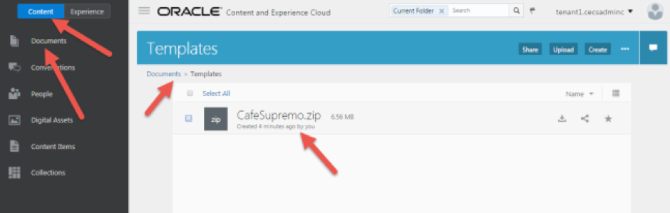
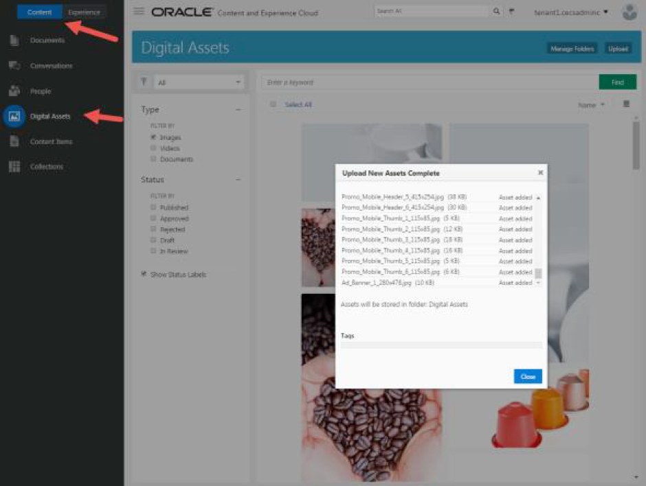

# ORACLE Cloud Test Drive #

## Lab 1.3. Upload Lab Resources to Content and Experience Cloud ##

### About this Lab ###

You need to upload the resources to your CEC environment. You can upload resources using the Web Interface, illustrated below or make use of the Desktop Client. 

>[What kind of content can I manage?](https://docs.oracle.com/en/cloud/paas/content-cloud/user/what-kind-content-can-i-manage.html)

>[What can I do with my files and folders?](https://docs.oracle.com/en/cloud/paas/content-cloud/user/what-can-i-do-my-files-and-folders.html)

>[How do I upload files?](https://docs.oracle.com/en/cloud/paas/content-cloud/user/how-do-i-upload-files-browser.html)

---

### 1.3.1 Upload Resources ###

1. Login to CEC using the User ID assigned to you. 
2. Create a folder in ``Content -> Documents`` called **“Templates”** 
3. Upload or Drag and Drop the CafeSupremo.zip file into the **“Templates”** Folder

 
4. Unzip **Images.zip** into a local folder 
5. Upload or Drag and Drop all images into ``Content -> Digital Assets``. This may take several minutes to import all images. 

6. Click the **Close** button to close the upload pop up window. 

---
# Lab Exercise: #
Next: [Lab 1.4. Import Template and Components](104-CecsLab.md) >>

<< [Lab 1.2. Lab Resources](102-CecsLab.md)
