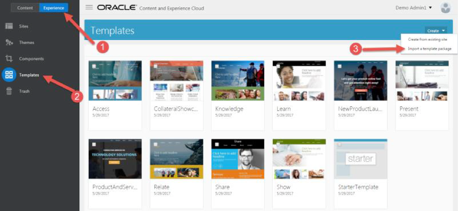
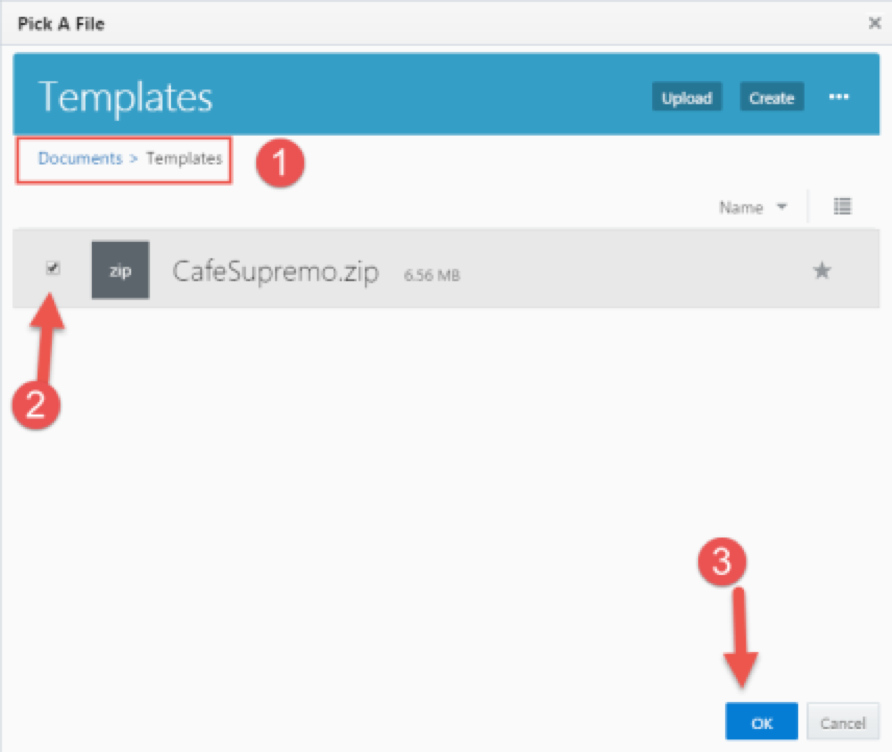
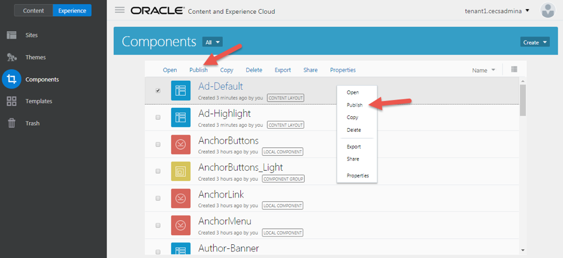
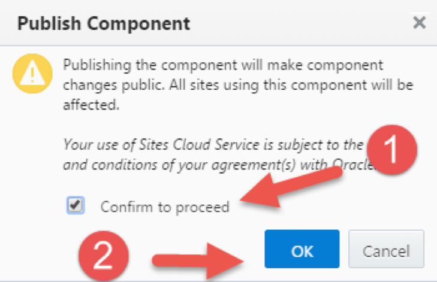
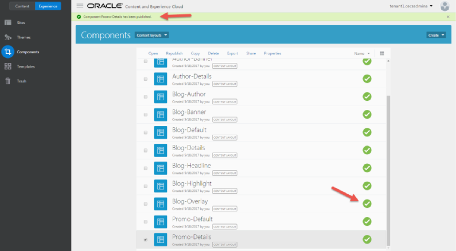

# ORACLE Cloud Test Drive #

## Lab 1.4: Import Template and Components ##

### About this Lab ###

In this exercise, you will learn how to import the template and components for the CafeSupremo Marketing site.

>[What is a template?](https://docs.oracle.com/en/cloud/paas/content-cloud/user/what-is-template.html)

>[What is a component?](https://docs.oracle.com/en/cloud/paas/content-cloud/user/what-is-component.html)

>[What is a custom component?](https://docs.oracle.com/en/cloud/paas/content-cloud/user/what-is-custom-component.html)

>[How do I import a template?](https://docs.oracle.com/en/cloud/paas/content-cloud/user/how-do-i-import-template.html)

---

### 1.4.1. Import Template ###

1. Navigate to ``Experience -> Templates``. Click ``Create -> Import`` to import a template package.

2. Select the Templates folder, then select the CafeSupremo.zip and click **“OK”**. 

>Note: If you are prompted to replace or create a new component, just except the default by clicking **OK**.

 

3. You have successfully imported the template. 

### 1.4.2. Publish the Components ###

1. Navigate to the ``Experience -> Components`` page 
2. Select the components and click the **“Publish”** link. You may also select the component and right click to bring up the context menu to publish the component. 
The menu bar will not appear until a selection is made. 

**_Note:_**

>You need to repeat this step until all content layout components are published. 

>If you have too many components and you only want to select the content layout components, you can use the components filter to display only the content layouts component. 

3. On the publish component page, click **“Confirm to proceed”** and then OK to publish the component. 

4. You have successfully published the component. 

---
# Lab Exercise: #
<< [Lab 1.3. Upload Lab Resources to CEC](103-CecsLab.md) | [Lab 1.5. Creating a New Site](105-CecsLab.md) >>
