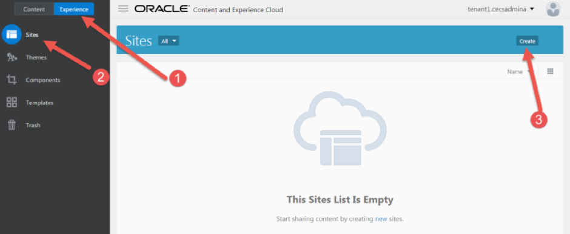
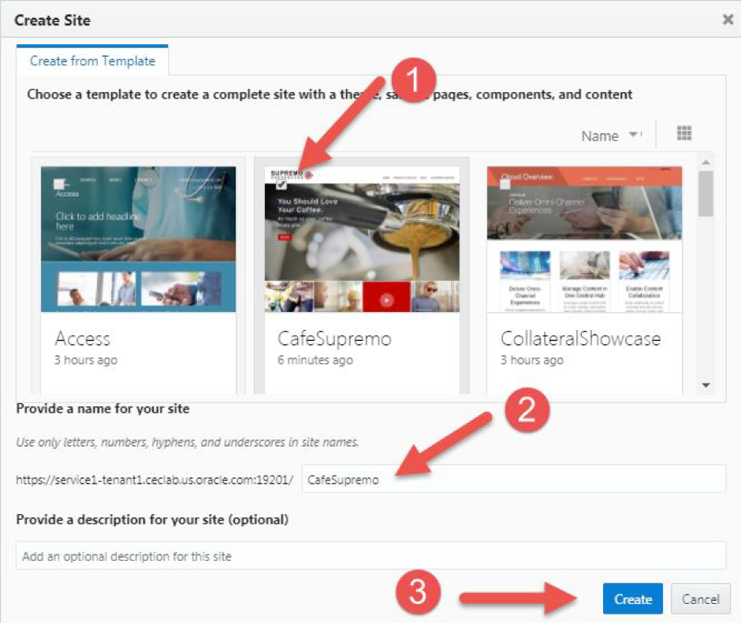
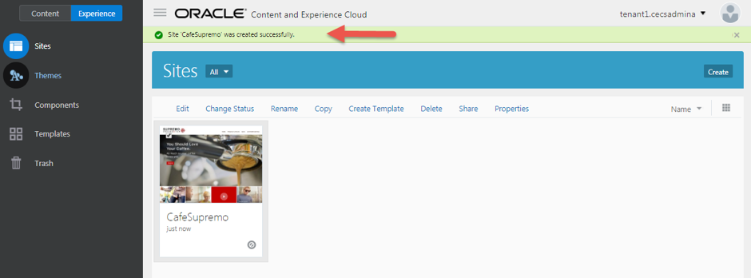
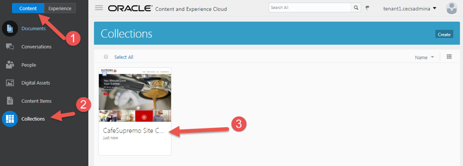
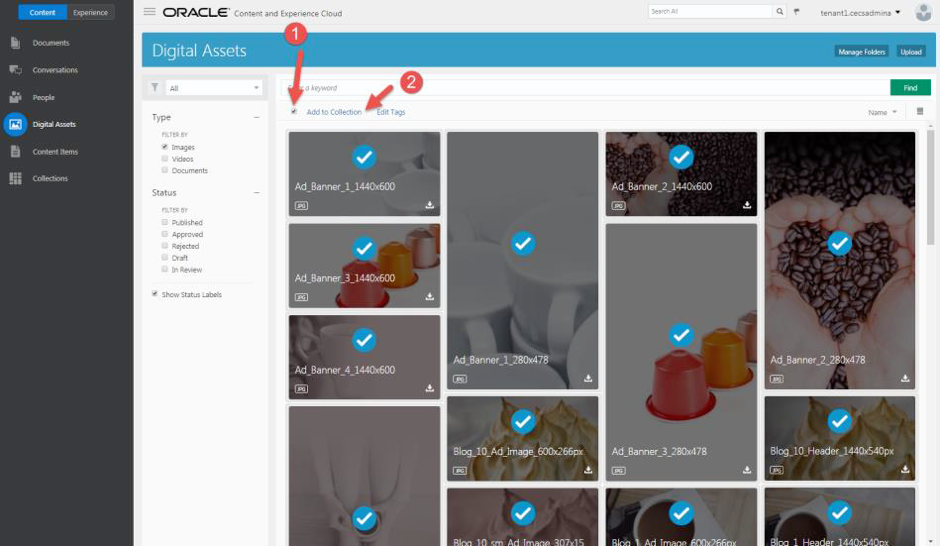
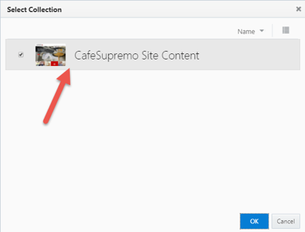
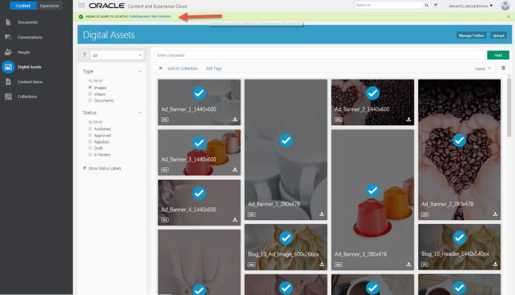
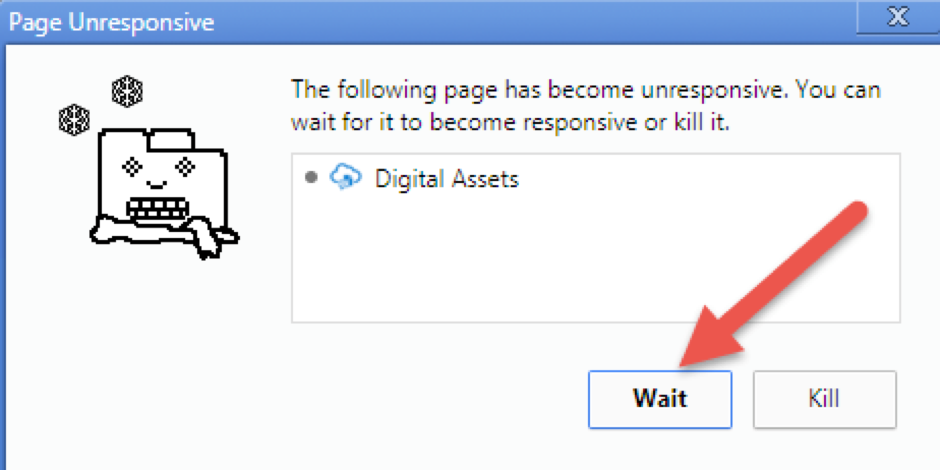
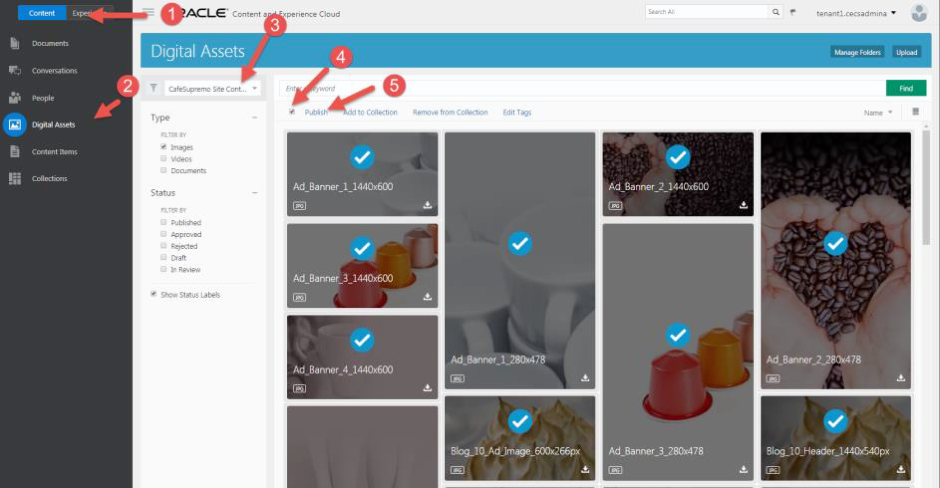

# ORACLE Cloud Test Drive #

## Lab 1.5. Creating a New Site ##

### About this Lab ###
In this exercise, you will create a CafeSupremo marketing site using the template and
component you just imported.

>[Quick tour of the **Experience** home page](https://docs.oracle.com/en/cloud/paas/content-cloud/user/quick-tour-experience-home-page.html)

>[What is the Site building process—in a nutshell?](https://docs.oracle.com/en/cloud/paas/content-cloud/user/what-is-process-nutshell.html)

>[What are content types, content items, and collections?](https://docs.oracle.com/en/cloud/paas/content-cloud/user/what-are-content-types-content-items-and-collections.html)
---
### 1.5.1. Create a Site ###

1. Navigate to ``Experience -> Sites``, and click **“Create”**.

 

2. Select `CafeSupremo` template, and the name of the site **“CafeSupremo”** ,
then click **“Create”** to create the marketing site.

 

3. You have successfully created a site using the template.

4. Verify a collection has been created for the site. Navigate to ``Content -> Collection``, you will see the CafeSupremo Site Content has been
created.

### 1.5.2. Adding Assets to Collection ###

1. Navigate to ``Content -> Digital Assets``, click the **“Select All”** link, then click
**“Add to Collection”** link.

>**Note**: The **“Select All”** can only select items on
current page, you need to scroll down to the bottom of the page, and go to
click the next page button or the number of the page then
click the **“Select All”** and **“Add to Collection”** link again to add to collection

2. Select **“CafeSupremo Site Content”** and click the **OK** button.

  

>**Note:** If you are prompted by the browser to `kill the process`, please click **“Wait”**.

### 1.5.3. Publish Digital Assets ###

1. Use the filter to select all assets in the **CafeSupremo Site Content**
collection.

2. Click **“Select All”** to select all assets, then click the **“Publish”** link to publish
the assets.

>**Note:** You need to repeat this step until all digital assets have been published, this is
because the **“Select All”** can only select items on current page.

---
# Lab Exercise: #

<< [Lab 1.4: Import Template and Components](104-CecsLab.md) | [Lab 1.6: Creating Content Type](106-CecsLab.md) >>
