# ORACLE Cloud Test Drive #

## Lab 1.6. Creating Content Type ##

### About this Lab ###

In this exercise, you will learn how to create content type. You need to create 1 of the 4
content types used in this exercise:

- Ad_2017– You need to create this content type.
- Author – You need to create this content type, and you need to change the content layout.
- Blog – You need to create this content type, and you need to change the content layout.
- Promo – You need to create this content type, and you need to change the content layout.

>[How do I create and share content types?](https://docs.oracle.com/en/cloud/paas/content-cloud/user/how-do-i-create-content-type.html)

>[How do I create content items?](https://docs.oracle.com/en/cloud/paas/content-cloud/user/how-do-i-create-content-items.html)

---
### 1.6.1. Creating Content Type ###

1. Navigate to ``Content -> Content Items`` page, then click **“Manage Types”**.

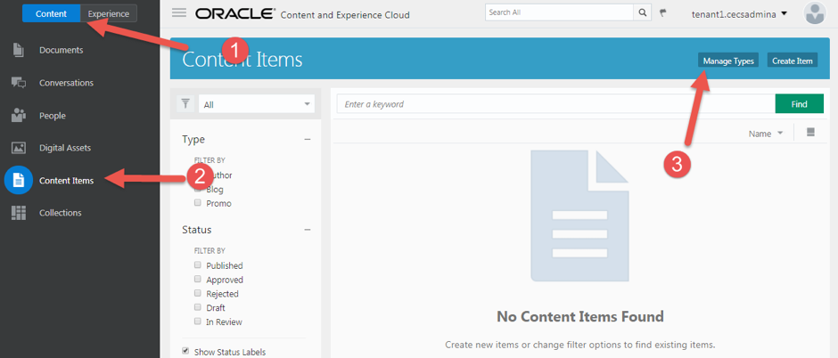

2. Click **“Create”** to create a content type.

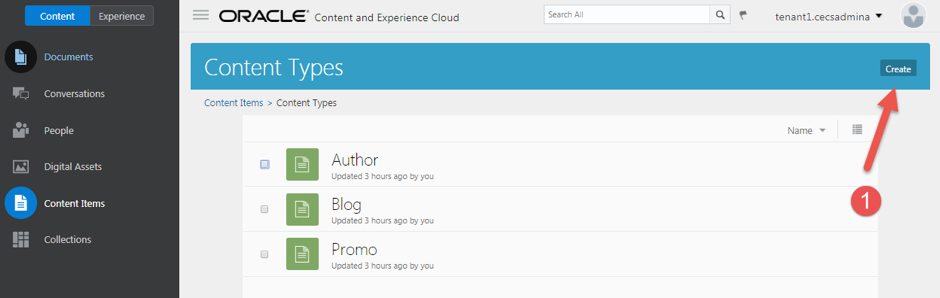

3. Enter the **“Ad_2017”** as the name of the content type and click **OK**.

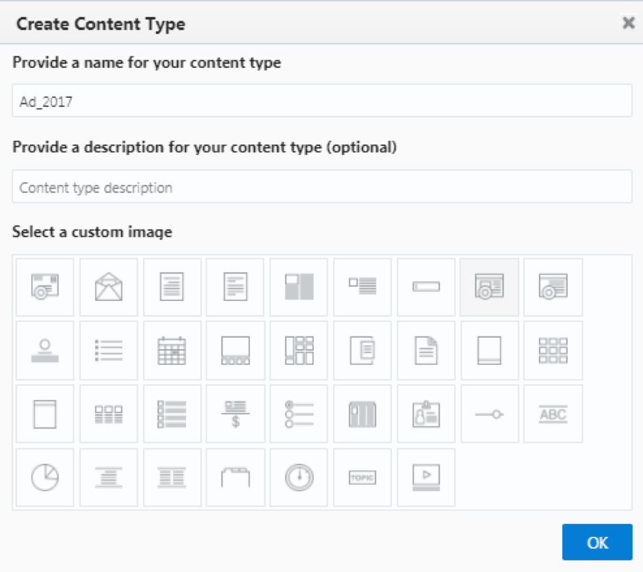 

4. Follow the information below to create the content type definition. Drag and
drop a data field into the `Content Type Definition` placeholder. Once you
dropped a data field into the placeholder, the data field setting screen will
appear.

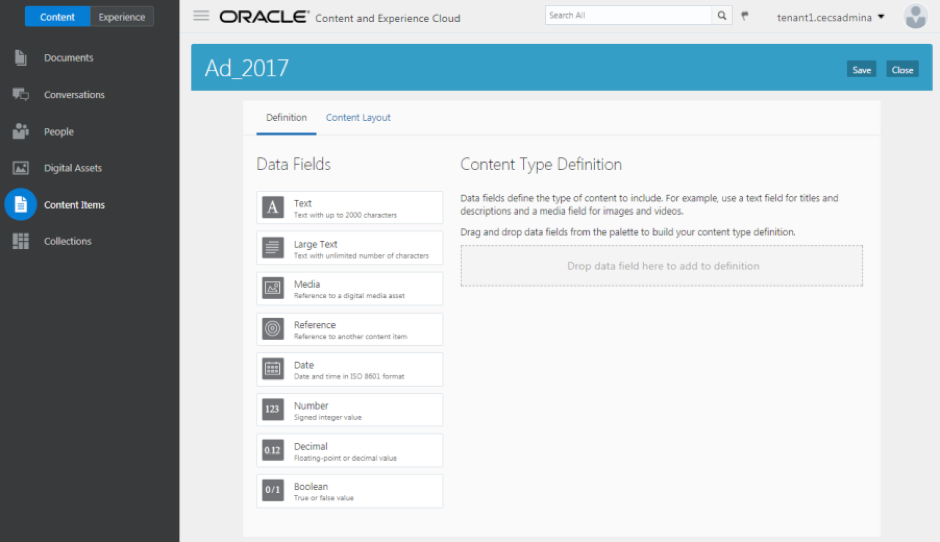

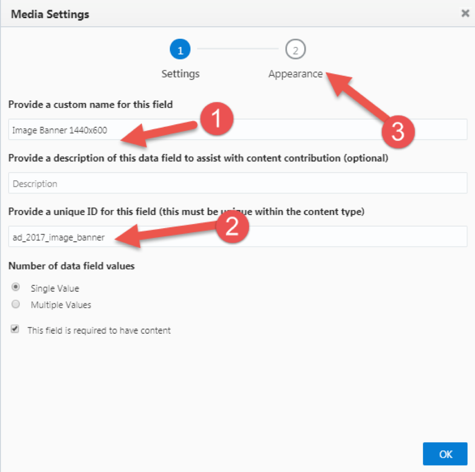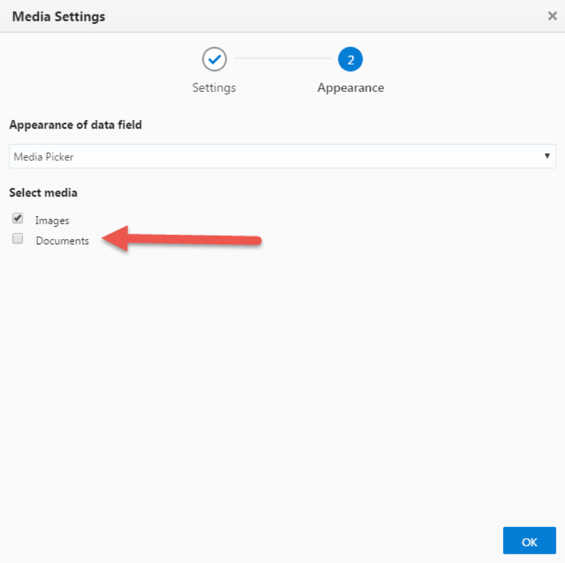

### Content Type Name: Ad_2017 ###

| Data Fields   | Name          | Id 			| Other Settings |
| ------------- | ------------- | ------------- | -------------  |
| Media  | Image Banner 1440x600  |ad_image_banner| Documents: `Unselected` |
| Media  | Image Side 280x478  |ad_image_side|Documents: `Unselected`|
|Text|CommerceURL|ad_commerceurl|**Custom validation:** Pattern validation: `Checked` Pattern: `URL`|
|Text|TextPosition|ad_2017_textposition|Single text box: `Single-select menu` Options: `Left`/`Center`/`Right`|
|Text|TextColor|ad_2017_textcolor|Single text box: `Single-select menu` Options: `Light`/`Dark`|

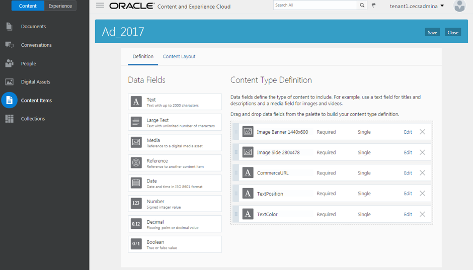

5. Click the **“Content Layout”** link.

6. Select following content layouts for the layout styles.

>**Note:** When you import the template, the name of the layout component will
have a running number suffix.

| Content Layout |  |
| ------------: | ------------- |
|Layout Styles|Default: `Ad-Default`|
||Highlight: `Ad-Highlight`|
||Tile View: `Ad-Default`|

7. If the **“Highlight”** style doesn’t exist, you need to add it by clicking the **“Add
Layout Style”** button, type the name of the style (Highlight) and press the
enter button on your keyboard.

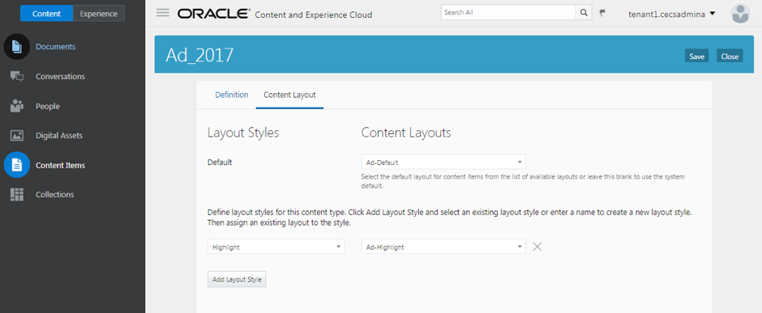

8. Click **“Save”** to save the content type.

10. You need to repeat the steps above for - `Author` – `Blog` –  `Promo` –

### Content Type Name: Author ###

| Data Fields   | Name          | Id 			| Other Settings |
| ------------- | ------------- | ------------- | -------------  |
|Media|Image Header 1440x540|author_image_header|Documents: `Unselected`|
|Media|Image Avatar 312x312|author_image_avatar|Documents: `Unselected`|
|Large Text|Bio|author_bio|Text area: `Rich-text editor`|

### Content Type Name: Blog ###

| Data Fields   | Name          | Id 			| Other Settings |
| ------------- | ------------- | ------------- | -------------  |
|Reference|Author|blog_author|Any content type: `Author`|
|Text|Category|blog_category|Single text box: `Single-select menu` Options: `HOW TO` `DRINKS` `PEOPLE` `RECIPES`|
|Large Text|Content|blog_content|Text area: `Rich-text editor`|
|Media|Image Header 1440x540|blog_image_header|Documents: `Unselected`|
|Media|Image Ad 600x266|blog_image_ad|Documents: `Unselected`|
|Media|Image Ad Small 307x150|blog_image_ad_small|Documents: `Unselected`|
|Media|Image Thumbnail 400x400|blog_image_thumbnail|Documents: `Unselected`|
|Text|TextPosition|blog_textposition|Single text box: `Single-select menu` Options: `Left` `Center` `Right`|
|Text|TextColor|blog_textcolor|Single text box: `Single-select menu` Options: `Light` `Dark`|

### Content Type Name: Promo ###

| Data Fields   | Name          | Id 			| Other Settings |
| ------------- | ------------- | ------------- | -------------  |
|Media|Image Banner 1440x720|promo_image_banner|Documents: `Unselected`|
|Media|Image Mobile Header 415x254|promo_image_mobile_header|Documents: `Unselected`|
|Media|Image Mobile Thumbnail 115x85|promo_image_mobile_thumbnail|Documents: `Unselected`|
|Large Text|Summary|promo_summary|Text area: `Rich-text editor`|
|Large Text|Content|promo_content|Text area: `Rich-text editor`|
|Text|TextPosition|promo_textposition|Single text box: `Single-select menu` Options: `Left` `Center` `Right`|
|Text|TextColor|promo_textcolor |Single text box: `Single-select menu` Options: Light Dark|

### 1.6.2. Change Content Item Layout ###

The Author, Blog and Promo content types were pre-created before you import
the content layout component, you need to configure the content layout for
these 3 content items to render the content item properly.

1. Navigate to `` Content -> Content Items -> Manage Types ``, and Click the **Create
Item button**.

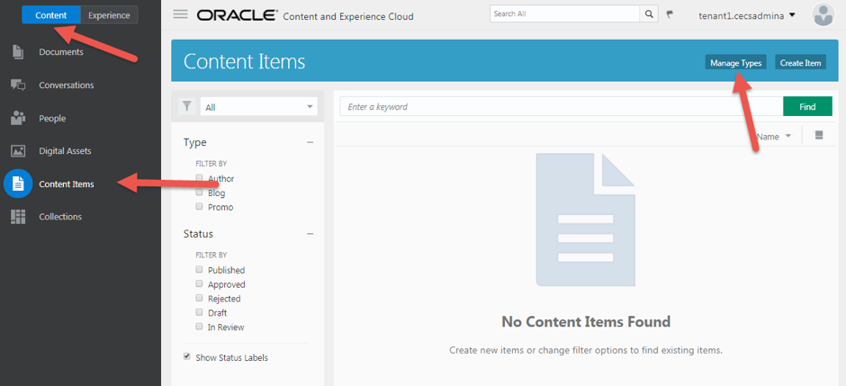

2. Click the ``Author content type``, then click the ``Content Layout`` link

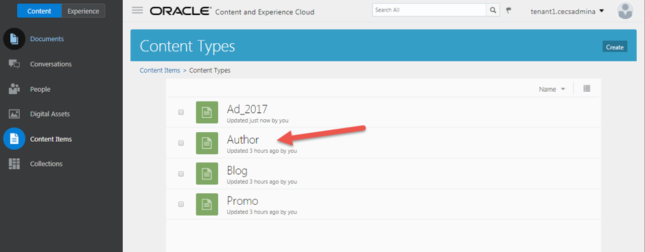

3. Change Author content type layout style to:

| Content Layout |  |
| ------------: | ------------- |
| Layout Syles   | Default: `Author-Details` |
||Details: `Author-Details` |
||Tile View: `Author-Details` |
||Banner: `Author-Banner`| 

4. Click **Save** to save the content type

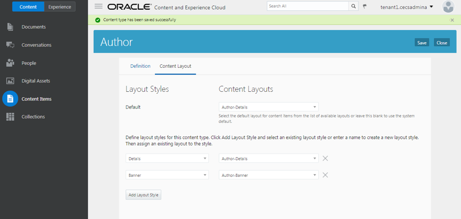

5. You need to repeat the steps above to change the Blog and Promo content type.

- Blog

| Content Layout |  |
| ------------: | ------------- |
| Layout Syles   | Content Items Default: `Blog-Default` |
||Content List Default: `Blog-Default` |
||Details: `Blog-Details` |
||Headline: `Blog-Headline`| 
||Author: `Blog-Author` |
||Highlight: `Blog-Highlight` |
||Overlay: `Blog-Overlay` |
||Tile View: `Blog-Default`| 
||Banner: `Blog-Banner`|  

- Promo

| Content Layout |  |
| ------------: | ------------- |
| Layout Syles   | Content Items Default: `Promo-Default` |
|| Details: `Promo-Details`|
||Tile View: `Promo-Details`|

---
# Lab Exercise: #

<< [Lab 1.5: Creating a New Site](105-CecsLab.md) | [Lab 1.7: Creating and Publishing Content Item](107-CecsLab.md) >>
