# ORACLE Cloud Test Drive #

## Lab 1.8. Using Content Item in Sites ##

---

### 1.8.1. Update the Content Layout Components ###

You need to update the **Ad-Default** and **Ad-Highlight** components to use the content type you created in previous exercise, this is because the field id used in the content
layout component is different from the one you created.

1. Navigate to ``Experience -> Components``.

2. Click on the ``Ad-Default`` to open the component.

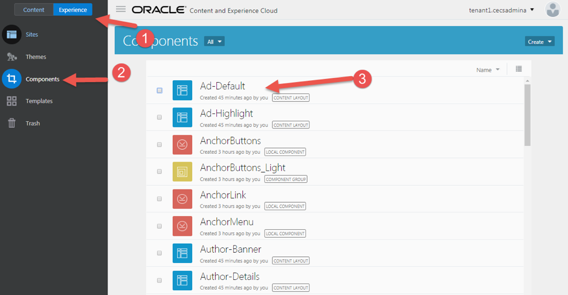

3. Go to assets folder and click on the download link the following files to your local machine.

a. render.js
b. layout.html

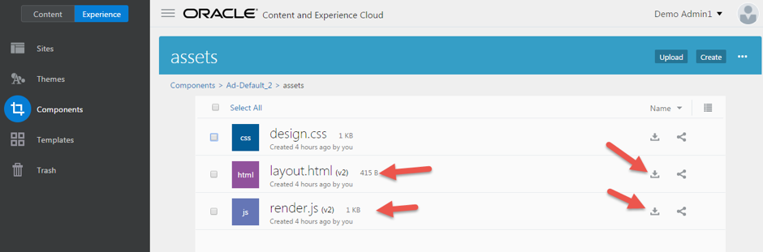

4. Use the text editor to open the ``render.js`` file and change the ID of the
content item field to the ID of your ``Ad_2017content item``.

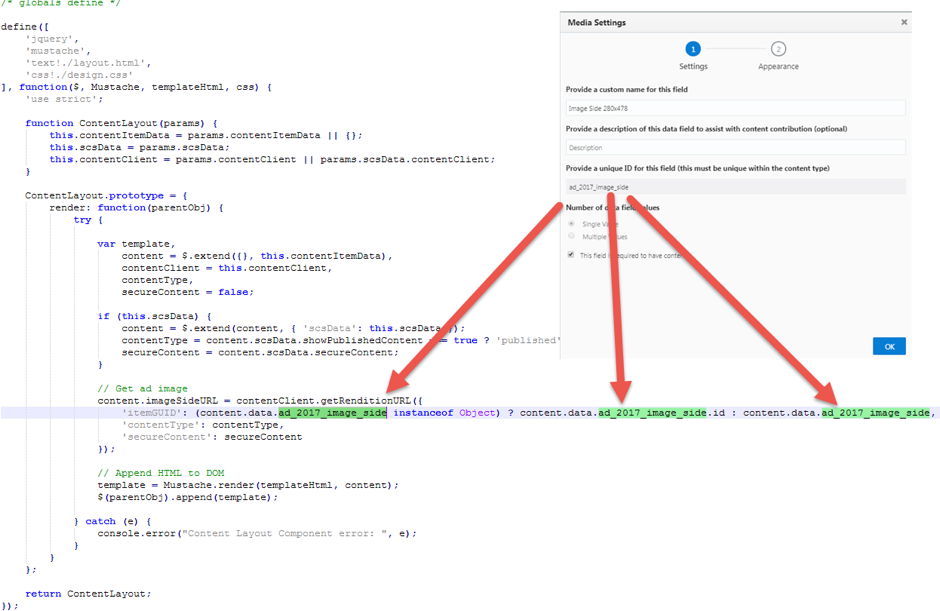

5. Use the text editor to open the ``layout.html`` and change the ID of the content
item field to the ID of your ``Ad_2017content item``.

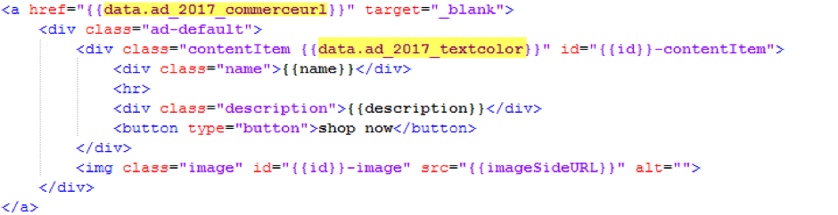

6. Drag and Drop the ``render.js`` and ``layout.html`` you just edited to replace the
version in Ad-Default.

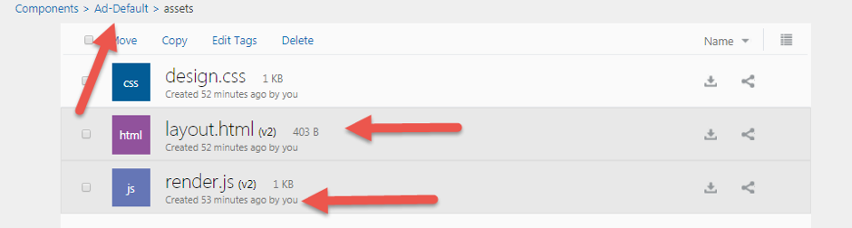

7. You need to do the same for ``Ad-Hightlight`` content layout component.

8. Republish the ``Ad-Default`` and ``Ad-Hightlight`` component.

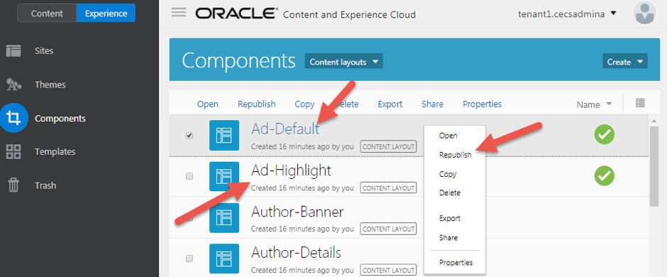

9. To verify the content layout component, navigate to ``Content -> Content Items``, and select any Ad_2017 content items , then click ``Edit``.

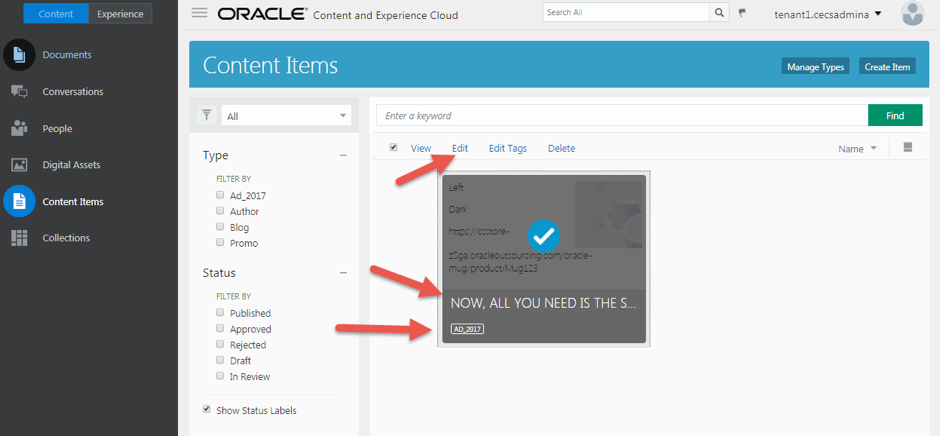

10. On the content item editor, change to **“Preview”**, then click the **“Content Layout”** link. You will notice the content item is rendered with the
Ad_Default content layout component. Change to Highlight layout to verify the Ad_Highlight content layout component  

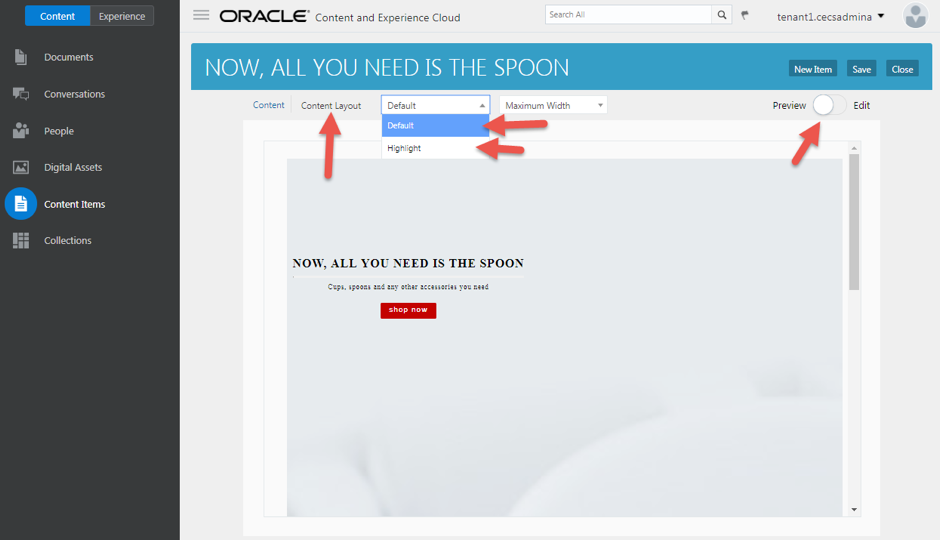

### 1.8.2. Add/Change Content Item ###

1. Navigate to ``Experience -> Sites``, then select the **“CafeSupremo”** site you’ve created, and click the **“Edit”** link.

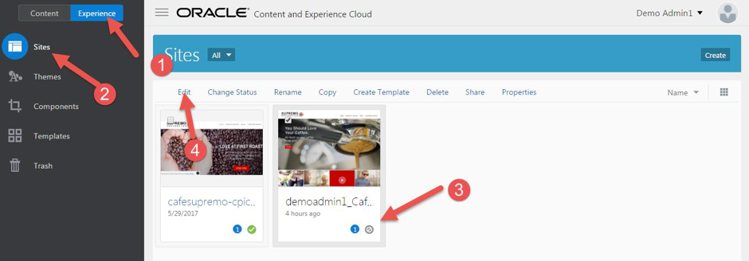

2. Provide a name **“Change Content Item”** for your update, then click **“Create”**. A new site editor page tab will be displayed.
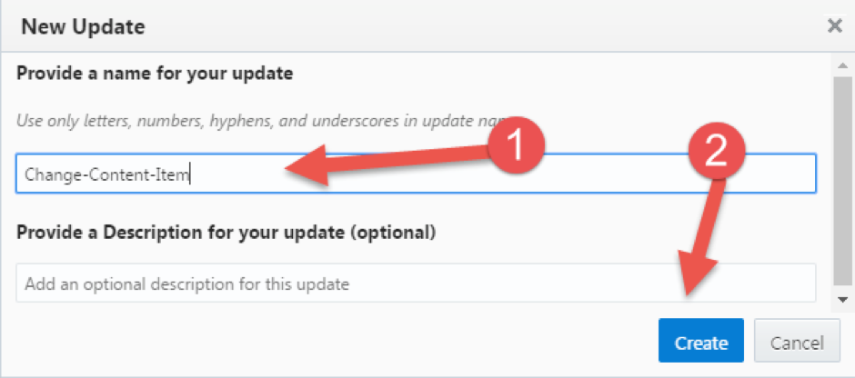

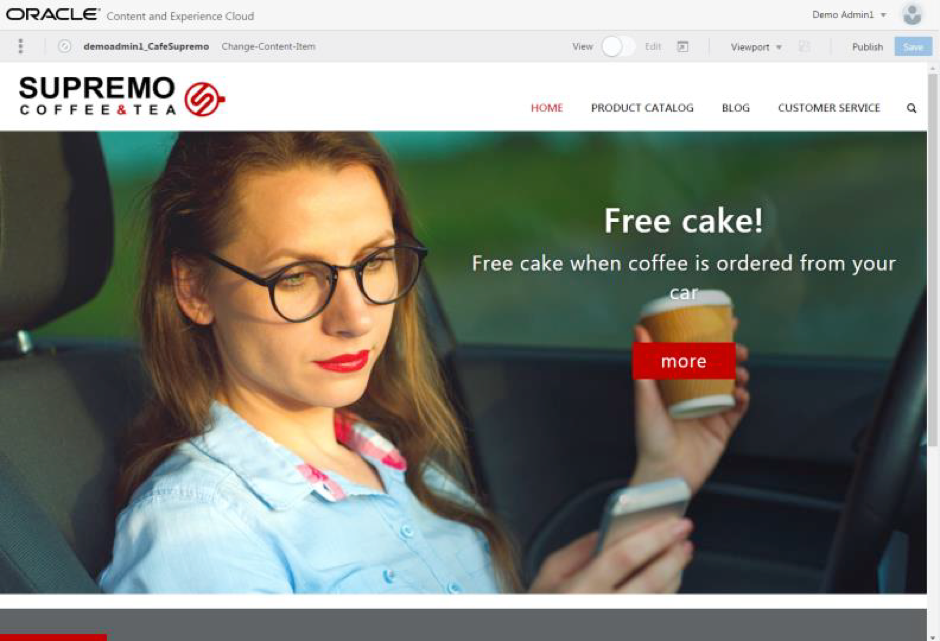

3. In the site editor page, click the **“Edit”** 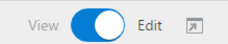 to enable editing.

4. Scroll down until you see the **Content List: Ad** and open the **Settings** for
this placeholder.

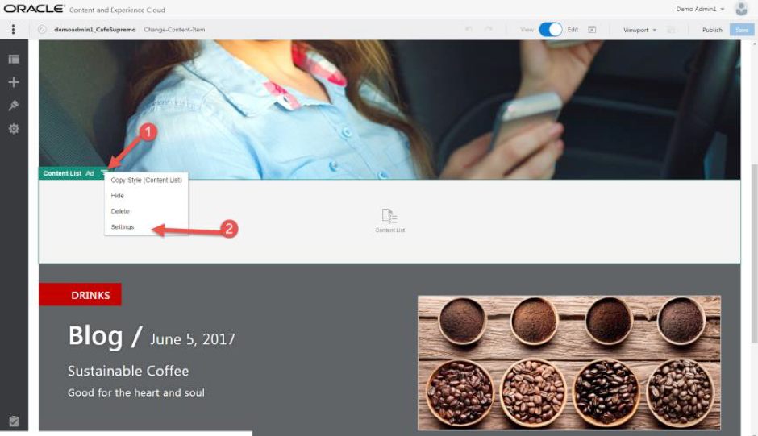

5. On the setting page, select **Ad_2017** as the content type, then click the
**Close** button to close the setting page.

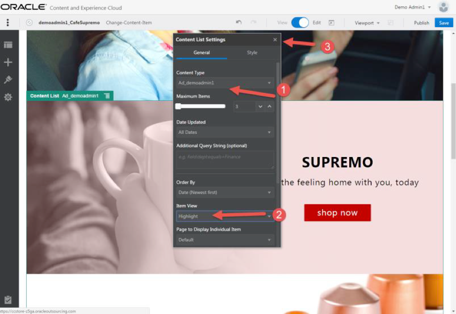

6. You will see the content item you just created for this content type appear on
the home page.

7. Open the ``Site Tree``. Click the ``BLOG page``, then click the ``BlogDetails``.
Change the Content **List: Ad** to **Ad_2017**.

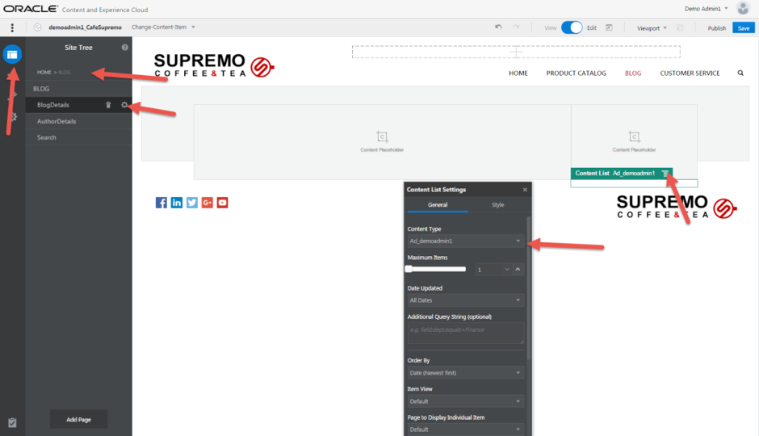

8. Click **Save** to save the site.

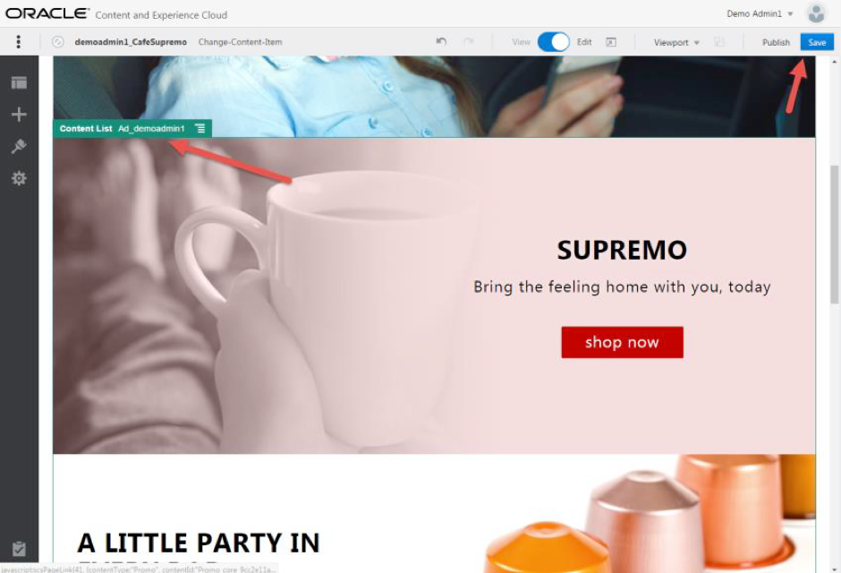

### 1.8.3. Change the Content List Settings ###

1. Select the **Content list: Ad_2017** placeholder and open the **Settings**

2. In the **Settings**, change the ``Maximum Items to 2``, You will notice only **2**
content items will be displayed on the list.

3. In the settings, Change the layout of the content **Order By** to ascending
**(Name Z-A)**.

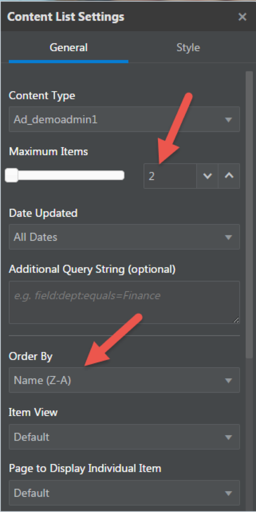

4. Change the item view to **“Default”** and the list view to **“Two Columns”**. You
will notice the content list placeholder for **Ad_2017** has change to 2 columns

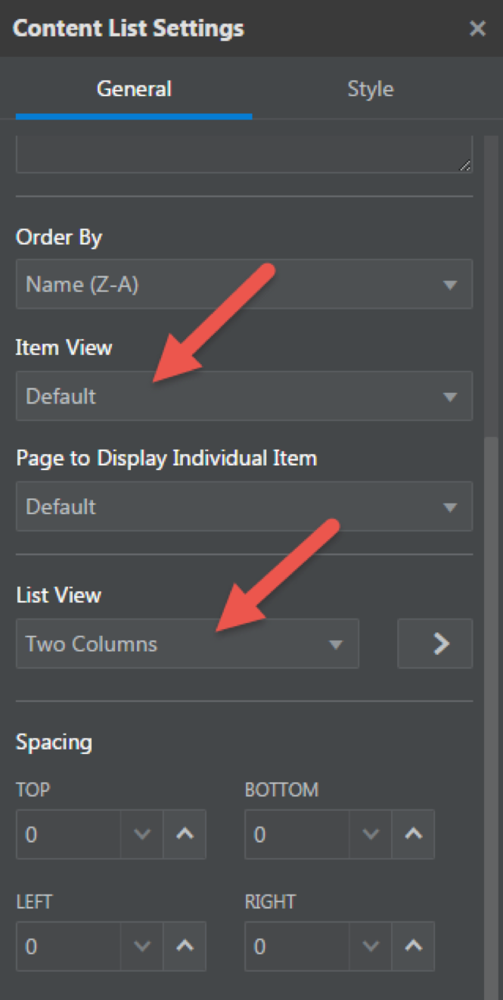

5. Scroll down and open the settings for **Content List Blog**. Ensure the **Order By is Newest First**.

6. Navigate back to ``Content -> Content Items`` to add a new **Blog content item**.

7. Navigate back to the site editor and refresh the page, you will see the latest
blog item is displayed on the page.

8. Click **Save** to save the site.

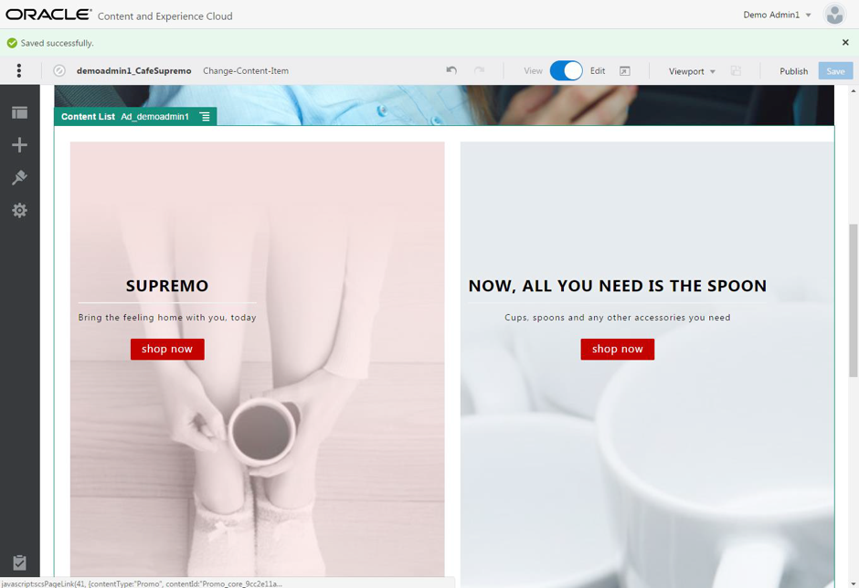

9. Click the `preview button` to open the site in another browser tab in preview mode.

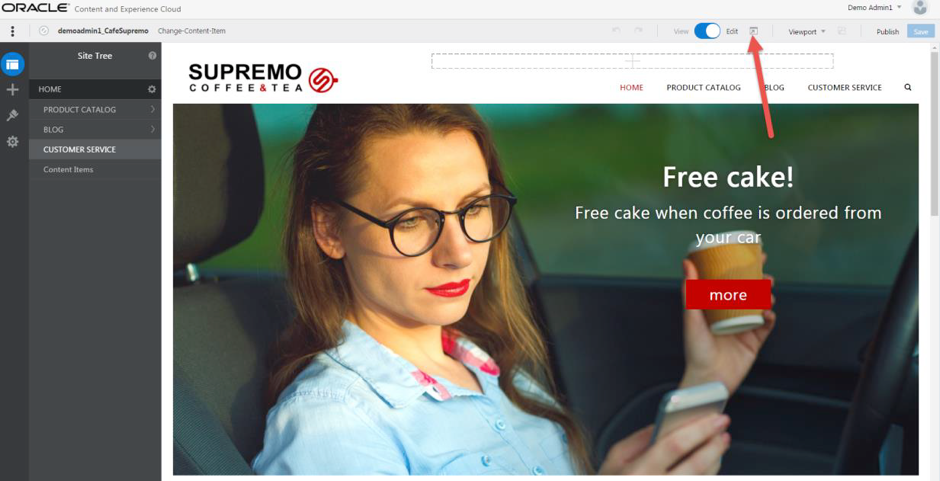

## Congratulations! You have successfully completed this Sites and Content lab. ##
---
# Lab Exercise: #

<< [Lab 1.7: Creating and Publishing Content Item](107-CecsLab.md) | [Back to CECS Cloud Test Drive Home](../README.md) >>
