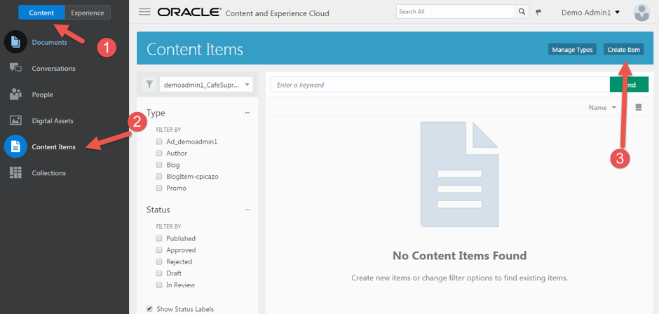
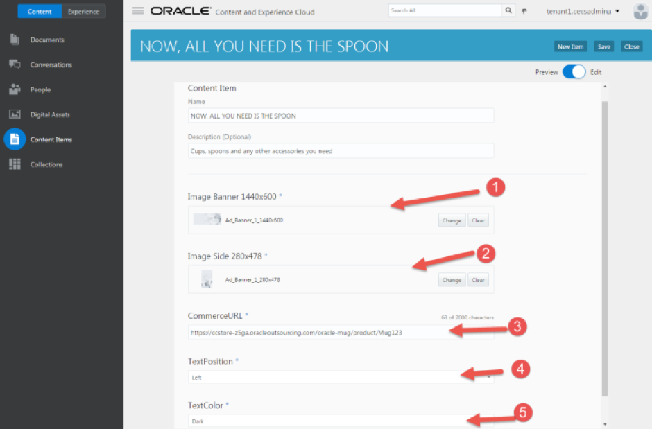
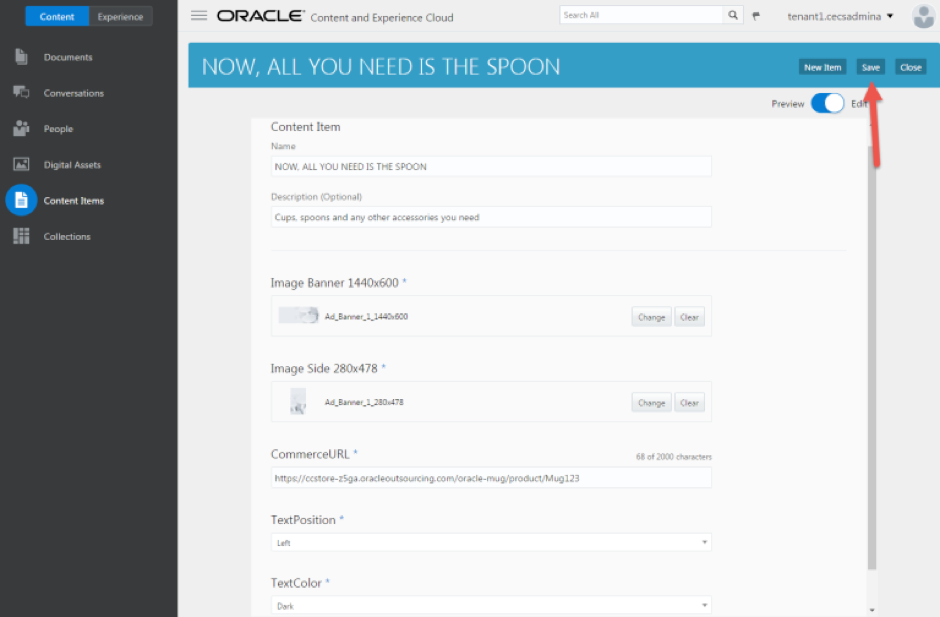
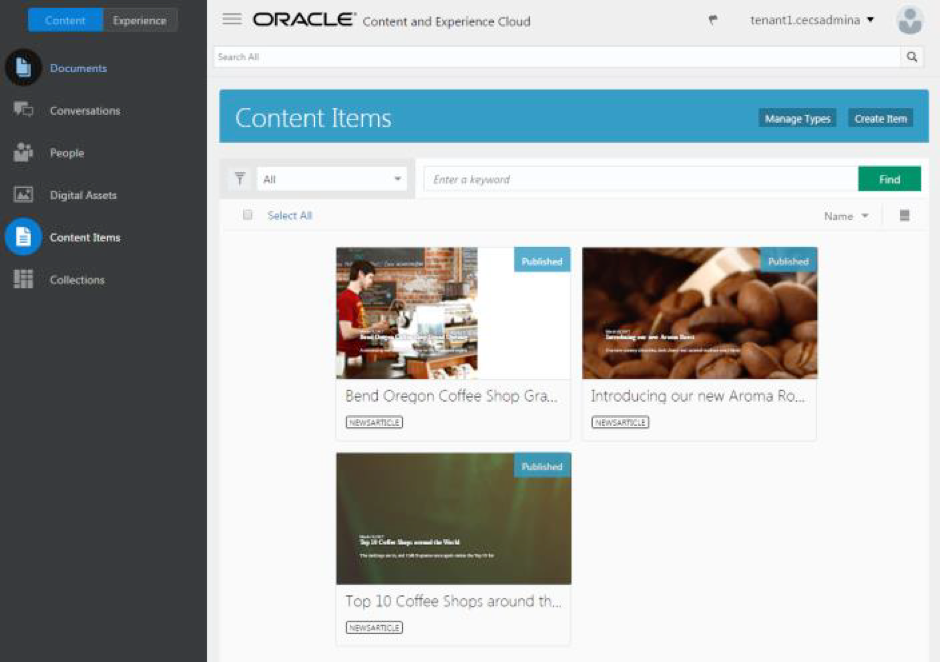
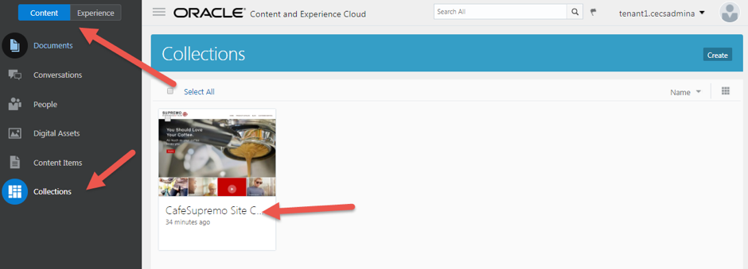

# ORACLE Cloud Test Drive #

## Lab 1.3. Creating and Publishing Content Item ##

### About this Lab ###
In this exercise, you will learn how to create content item using the content type
created in previous exercise.

### 1.3.1. Create Content Item ###

1. Navigate to ``Content -> Content Items``, and Click the ``Create Item`` button.

2. Select the **“Ad_2017”** content type you just created, select **“CafeSupremo Site Content”** collection and enter the content item information in [Appendix A](../resources/AppendixA.md) and click **“OK”**.

3. Click **Save** to save the content item.

4. Repeat until you create at least 2 content items for each content type in [Appendix A](../resources/AppendixA.md).

### 1.3.2. Publish Content Items ###

1. Navigate to ``Content -> Collections``, and click on the ``CafeSupremo Site Content`` collection.

2. Select all content items and click the Publish button to publish the item. You need to make sure all items in this collection are published.

3. Verify the status of all items in this collection are published.

---
NEXT: [Lab 1.4: Using Content Item in Sites](114-CecsLab.md) >>

