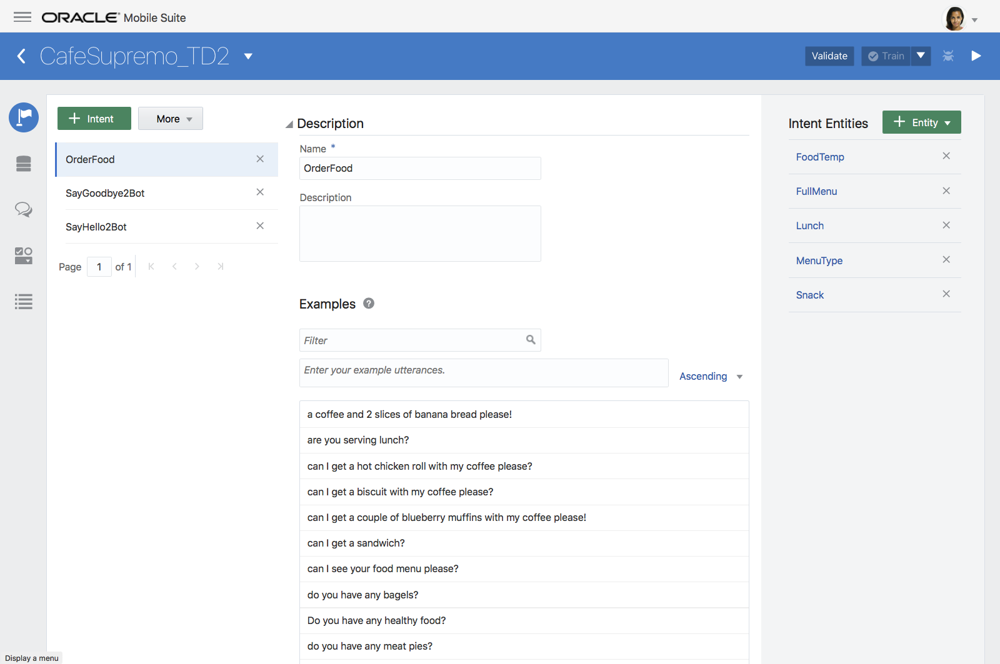
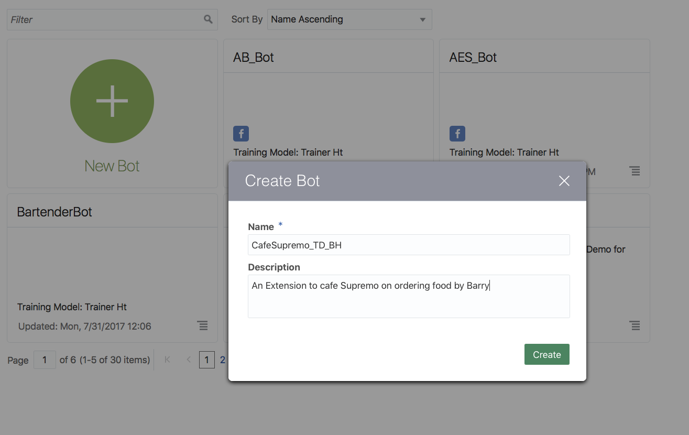
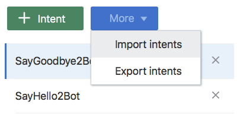
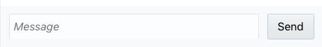
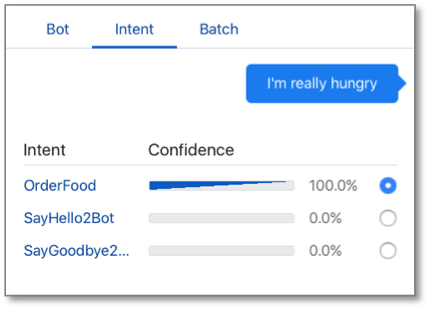
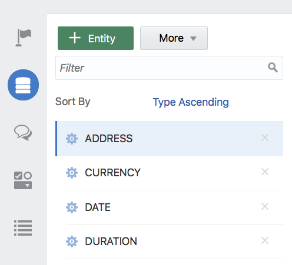
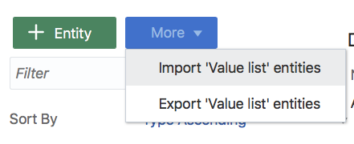
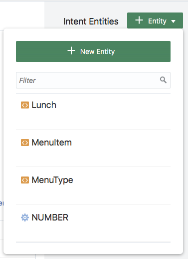
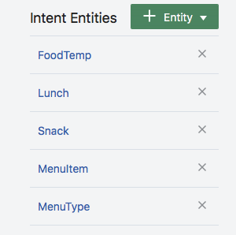
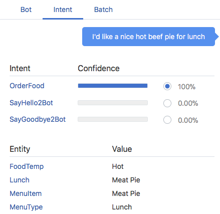

# ORACLE Cloud Test Drive #

## Lab 2: Building a Bot ##

### Introduction ###
When designing an AI based Chat Bot conversation there are a number of pieces that need to be taken into account, these include the following;

 - **Intent:** What is the goal of the user when asking the question (known as an Utterance) of the Bot.  For example, in a Banking related Bot a user asking “What is my Balance” implies an intent to get the current balance of their bank account. 
 - **Entities:** The important piece(s) of information in the utterance, that specifies the specific object or function for which the intended goal is to be applied.  For example “What is the balance of my Savings account” would imply that the question relates to their savings account. 
 - **Steps or States:** The individual questions and/or responses that make up the conversation flow. In the Oracle Intelligent Bot the States are implemented by a named “Component” of the dialogue flow.
 - **Dialog Flow and Decision Points:** Based on the question and/or response from the user (or the Bot) move the conversation forward to another step in the dialogue flow.
 - **Variables:** Hold the context of the conversation so far, allowing the bot to remember what has been discussed and to allow the user to go “off-topic” and return to the conversation.

The Oracle Intelligent Bots Platform provides a low-code tool, the Oracle Intelligent Bots Builder that allows customers to develop their Chat-bots from a web browser. These tools provide the ability for the customers to create a new chatbot, define the intents, entities, the dialog flow, define the custom components and configure the chatbot to connect to one or more channels. 



Furthermore, the environment provides the ability to test the Natural Language Processing (NLP) and its impact on the dialogue flow in real time (through the tester interface), allowing the Bot developer to fine tune and re-train the chatbot as required to improve its domain understanding and hence end user experience.

In this Lab you will be utilizing the Oracle Intelligent Bot Builder to extend the Café Supremo Bot to include the ability to order food from a menu – either just a snack or a full lunch order.
By specifying a number of new intents and Entities you will be teaching the Bot the required concepts to respond to a customer asking for some food in the café.

### Prerequisites ###
In order to simplify the creation of the bot, you will be importing a previously defined set of Intents and Entities, as well as the definition of a simple dialogue flow (defined in Oracle Bot Markup Language).  

Download the following to a convenient location and unzip the archives to access the various objects being used in the exercise:
 - [Intents, Entities and Utterances for FoodMenu Bot](Lab_Files/Intents-And-Entities.zip)
 - [OBotML dialogue flow markup for ordering Food](Lab_Files/DialogYAML.zip)

### Exercise Steps ###

1. Access the Oracle Mobile Cloud Bot Builder using the following URL.

```http://<hostname>:8080/botsui/bot```

Your Instructor will give you the Mobile Cloud host name to use
(if you are using the local Virtual Machine image use *"localhost"* as the hostname)

2. Create a new Bot called ``“Café_Supremo_TD_[YOUR INITIALS]"`` 
 * Replace ``"[YOUR INITIALS]"`` with your initials - including the "[ ]"
 * give it a description **“Cafe Supremo Extension built by [YOUR NAME]"** (again replacing the place-holder with your full name or initials).



3. Click on the **``[import Intents]``** Button and import the Greeting intents from
the **“Intents and Entities”** folder.


4. Click the ``[More]`` button select import intents from the drop down menu.



5. Import the **``“OrderFoodIntent.csv”``** file to load a further Intent.

6. Click on each of the Intent names in the list to see the Utterances that have been associated with that given intent


7. Click the Train Button to train the engine on the supplied Utterances


8. Click the "Play Button" (ther right facing triangle) to launch the Bot Tester


Click on the “Intent Tab”


9. Try entering some input (utterance) into the message entry field at the bottom of the Chat Runtime Tester to determine what the NLP/ML had determined is your selected intent.



As suggestions; try some of the following (or make up something similar)

- I’m really Hungry
- I’d like something for Lunch
- Good morning Mr Bot!
- I’d like a bite to eat
- bye bye!

Confirm that the Intent is as expected.

 
 


10. Enter the following utterance

- **"I could really go for some real food"**

**NOTE:** Notice that the NLP (Natural Language Processing) was unable to explicitly determine the intent based on the current set of example phrases (corpus), though it still highlighted the best option. 


11. Train the NLP engine with this additional example phrase by the following: 
- Select the Radio Button that represents the best **Intent** (in this case the **"OrderFood"** intent) and click the **``[Add Example]``** Button.
- Click the '[Train] button again, which now shows a **(!)** to indicate that the sample set has changed..


12. Re-Enter the previous utterance into the Bot Tester and again observe the determined intent.


13. Click the Tester Play button again to remove it.

14. Click on the Entities Icon on the left hand side tool bar ( 2nd icon down )



15. Click the [More] Button and select Import “Value List” Entities



16. Import the **OrderFoodEntities.csv** and **YesNoEntity.csv**

17. Manually create a new Entity by Clicking on the ``[+ Entity Button]`` – Name the new Entity **“FullMenu”**

Select the **“Entity List”** option from the Configuration Drop down menu and then click into the Entities field below the dropdown list.


Choose the “Lunch” and “Snack” lists to create a “super list” entity made
up of both sub lists.

18. Go back to the Intent Tab (top Icon) and select The “OrderFood” Intent and click on the ``[+Entity]`` Button in the Top Right Corner.



19. Scroll down the list and select the various custom Entity Definitions (with Orange Box) to add them to the current intent (MenuItem, FoodTemp, Lunch, Snack, MenuType)  

Associating the Entity with the Intent gives a meaningful domain to the possible values and hence makes it easier for the  NLP to evaluate the appropriate information.



20. Restart the Tester (click the RESET button if it still shows your previous
entry).

21. Enter an Utterance to see how it has evaluated the Entities with the
defined intent.

eg. **"I'd like a nice hot beef pie for lunch"**



22. Open the file **OrderFoodDialog.txt** file in the DialogYAML directory in a
text editor and select all the Text (cntrl-A)

23. Select the Dialog Tab in the left hand toolbar (3rd Icon)


24. Delete the Default Starter BotML (YAML) code and paste in the contents
of the ``**OrderFoodDialog.txt**`` file opened previously.

25. Click the Validate Button to Confirm that the 'cut and paste' was successful.


26. Restart the Tester and change to the “Bot” tab

27. Enter a number of Utterances to observe the flow of the Bot.

- I’m really Hungry
- I’d like something for Lunch
- Can I have a chicken wrap
- I’d like a bite to eat
- Could really go for some real food
- Can I have a slice of Banana Bread with my coffee please?

(Try some others of your own)

# End of Lab 2: #

<< [Back to Intelligent Bot Test Drive Home](README.md)
