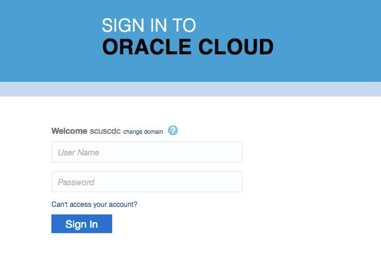
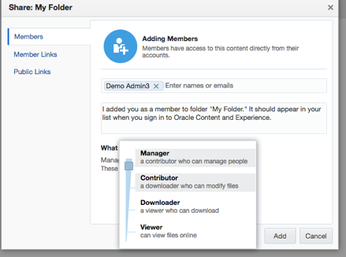
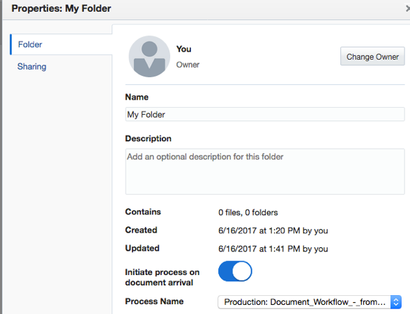
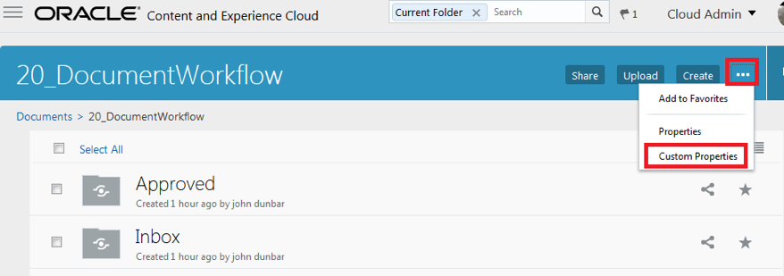
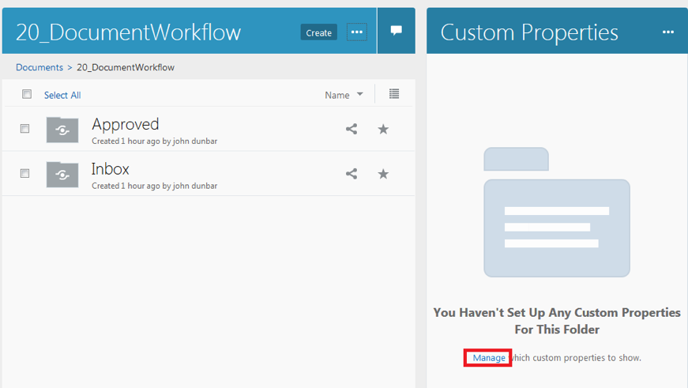
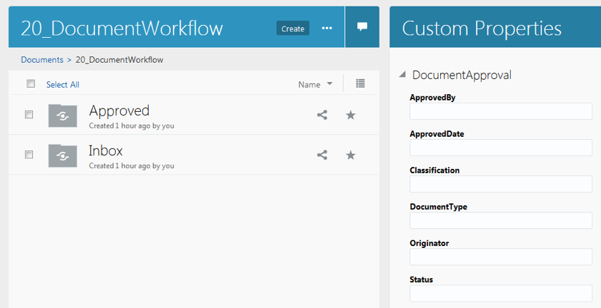
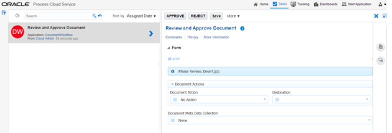
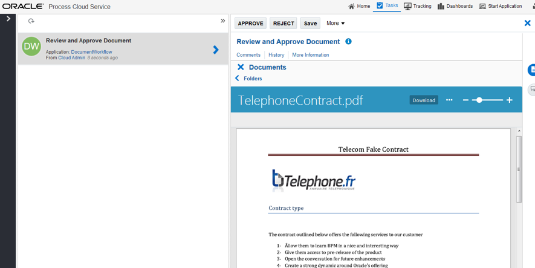

# ORACLE Cloud Test Drive #

## Lab 2B: Document Workflow in Content and Experience Cloud ##

### 4.	Setting the workflow in CEC ###

Open your preferred web browser and navigate to your Oracle CEC site (eg. https://documents-gseXXXXXXXX.documents.us2.oraclecloud.com/documents)
 

 
>**Note:** Login with the the username / password that you have been given by your training administrator.

You will see the CEC WebUI.

In the previous lab we have created a Custom Property **‘userXX_DocumentApproval’** and assigned it to a folder **‘xx_Document Workflow’**.

### 4.1. Now we will create the necessary sub-folders for our document workflow sample. ### 

1.	Tick the checkbox beside your **xx_Document Workflow** folder. 

2.	Select ``Share`` from the upper menu

3.	Share your folder with **Your Colleague ID** and give this user ``contributor`` rights

4.	Inside the **‘xx_Document Workflow’** folder, create a subfolder **‘Inbox’**.

5.	Create another subfolder **‘Approved’** on the same level.

6.	We are now using this folder to assign a document workflow process from Process Cloud to it.

7.	Select the **Inbox** folder. 

8.	Select the **Properties** link.

9.	Set the toggle field to **“Initiate Process on Document Arrival”**

10.	Select the Process Name ``xx_Production:Demo_Document_Workflow 0.1.`` This is how you are linking your folder to the process you want to trigger upon arrival of a document.

11.	Select **Save**. Reopen the properties to make sure that your settings have been taken into account. It should look like this:

12.	Next, verify that Metadata has been enabled for your DOCS environment, and what metadata collection has been set on your **‘xx_Document Workflow’** folder. 

13.	Return to your **xx_Document_Workflow** folder and enable the metadata for it: 

a.	Set the view on Customer Properties 

b.	You are likely to reach a screen as follows:

c.	Click the Manage button and push the “switch” to enable the DocumentApproval collection

d.	You should see something like this:

### 5.	Run the Scenario ###

Next we will run the Document Workflow Scenario using the PCS Web Client 

### 5.1	Run the Scenario using the PCS Workspace Web Client ###

### 5.1.1	Dropping a file into CEC ###

1.	Login to CEC. 

2.	Navigate inside your XX_Document Workflow folder.

3.	Open your Inbox folder.

4.	Drag and Drop any file of reasonable size from your laptop into the Inbox folder. Word or PDF are good candidates.

### 5.1.2	Displaying the task in PCS and viewing the Document ###

1.	Login to the PCS Workspace with your demouser ID. 

2.	Click on the Tasks link  at the top right.

3.	You should see a Review and Approve Document task in the list.

4.	Select the task in the list.

5.	Select the Document Icon to view the Document that you dropped into the folder.

 

### 5.1.3	Perform a Document Action on the task in PCS ###

You decided to move the document after the task is approved.

1.	``Close`` the document (click on the cross at the left of Documents.)

2.	From the ``Document Action`` dropdown on the form, select ``Move``.

3.	In the ``Destination`` dropdown, select ``Approved``.

### 5.1.4	Performing Meta-Data Operations ###

You also want to update the Meta-Data on the document itself. 

1.	On the form, Open ``Document Meta Data Collection`` dropdown on the form, select ``Document Approval``.

>Note: Document Approval is currently the only option in the dropdown that is supported.

2.	Result: The Document Information is displayed on the form. All fields are required. Add some significant values for **“approved by”** and **“originator”**, such as your own name.

3.	Fill in a value for each of the fields on the form.

4.	At the top of the form, click the ``APPROVE`` button to approve the task.

### Result: ###

a.	The task is completed in PCS.

b.	The Meta-Data is updated on the document.

### Congratulations you have completed the Lab! ###

# Lab Exercise: #
[Lab 2B: Document Workflow in Content and Experience Cloud ](201-CecsPCSLab.md) | [Back to CECS Cloud Test Drive Home](../README.md)
