# ORACLE Cloud Test Drive #

## Lab 2A: Content Metadata ##

### 1.	Introduction ###

This workshop will give you a brief introduction into the Oracle Content and Experience Cloud Metadata capabilities. 
During this workshop, you will learn more about the Oracle Content and Experience Cloud Service Metadata features via the WebUI.
The objectives of this lab are to:

1. Understand how to activate Metadata in Content and Experience Cloud.

2. Working with metadata and content.

### 2.	Background ###

Oracle Content and Experience Cloud Service comes with the capabilities to quickly categorize files and folders with additional descriptions, known as metadata. For example, perhaps users need to track when an item is approved and who approved it. You could create a custom property called “Document Approval” which lists fields such as file type, the originator of the file, who approved it, and when it was approved.

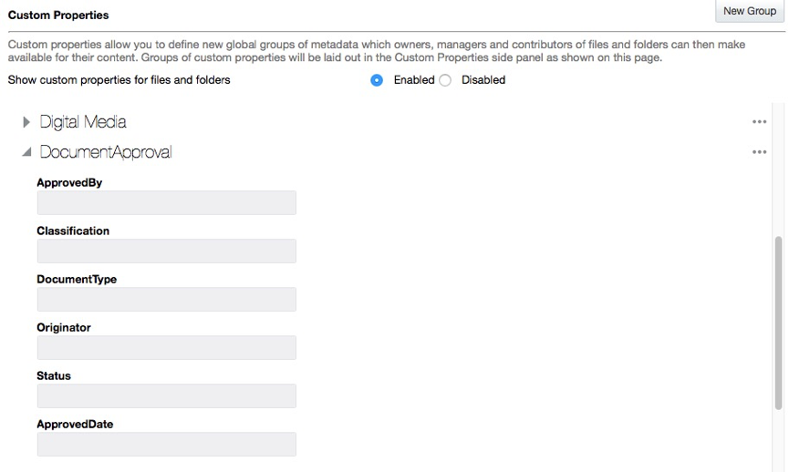

You could then move all files that have been approved into one folder and apply the custom property to the folder. All the files in the folder will be identified as approved. You can edit the custom properties for the different files to show their approval date, who approved it and any other pertinent details.

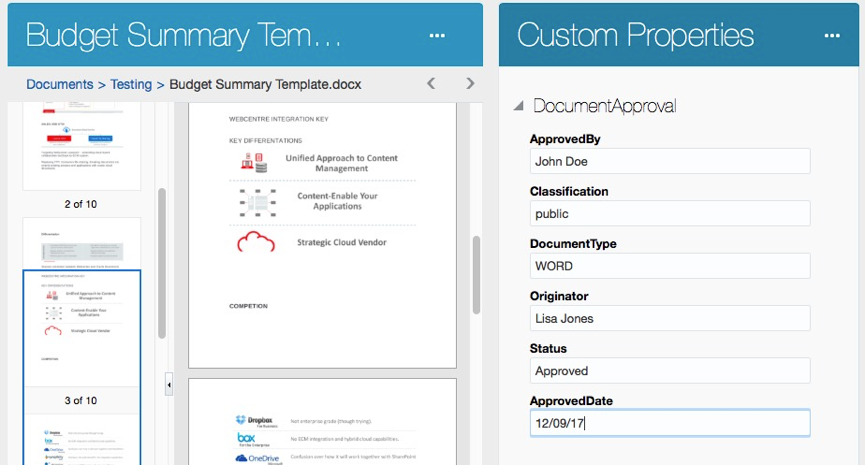

>Note: Although the documentation says that:

>Identity domain administrator, service instance administrator, service user or standard user/enterprise user
can work with Custom Properties, the manual also gets more specific and points out who can do what and where:

>People with the Owner, Manager, or Contributor role can apply custom properties to files and folders. People with the Viewer or Downloader role can view any properties that are set.

>The Content and Experience CS administrators can enable and create custom properties.

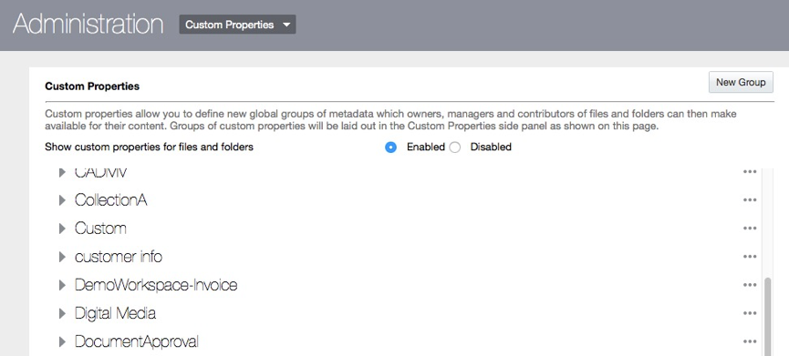

### 3.	Environment ###

CEC GSE Environment: 
(https://documents-gseXXXXXXXX.documents.us2.oraclecloud.com/documents)
	You will be provided with username and pwd during the lab.

### 4.	Lab Resources ###
There are no pre-requisites for this lab.

### 5.	Enable Custom Properties and Create a new group ###

1. Open your preferred web browser and navigate to your Oracle CECS site 

(https://documents-gseXXXXXXXX.documents.us2.oraclecloud.com/documents)

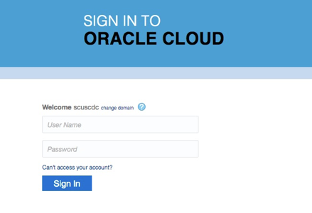

2. Login with the the username / password that does provide you administrator access to the CECS instance
You will see the CECS WebUI.

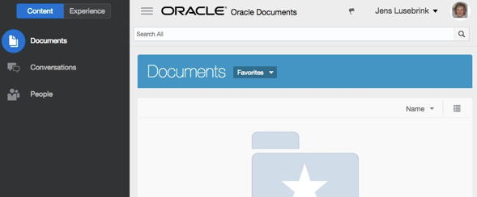

3. Open the Administration features by selecting the drop-down menu on the upper right corner beside the profile picture.

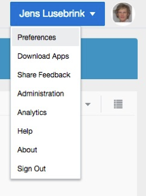

4. Here, select **‘Administration’** and see the changes on the main screen

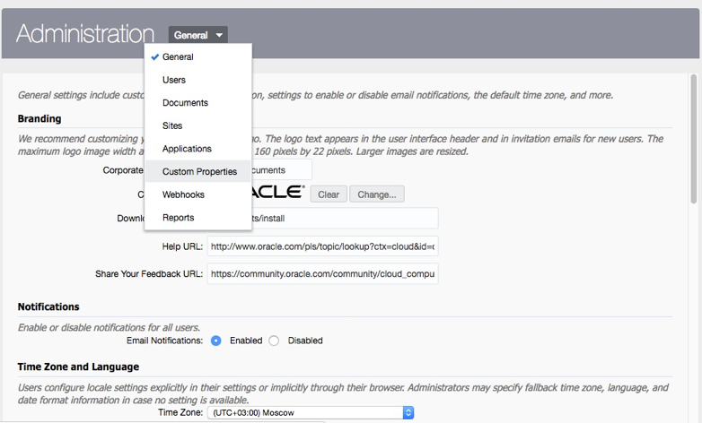

While there are many topics you can change in the **‘Administration’** pages we will have a look at the **‘Custom Properties’** section. 

5. Select **‘Custom Properties’**

Per default, on a new instance, the ‘Custom Properties’ are disabled so to not confuse the CEC users with an option that has not been configured.

In order to provide ‘Custom Properties’ to the end users, an Administrator has to enable them and create new groups.

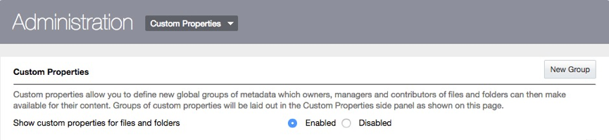

>**Note:** If not done already, please ENABLE **‘Custom Properties’**

A **‘Custom Property’** is a set of fields grouped under a given name that can hold values for describing content and folders and can be associated by an end user to content and folders.

### 5.1	Create a new ‘Custom Property’: ###

1. Still in the Admin UI, click New Group to create a group of fields associated with the property.
Enter a name for the property.

>NOTE: Please use your login name prefixed with your first name so that we can whom the Custom Property belongs to.

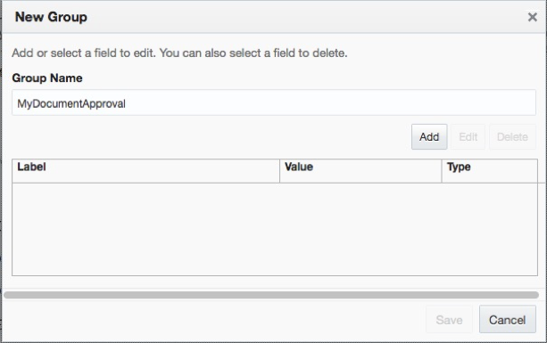

2. Click `Add` to create a new field.

>Note: Add fields in the order you want them to appear to users. 

3. Select the type of field you want to create (Text, Date, or Number). 
Enter a label for the field, then click Add. 

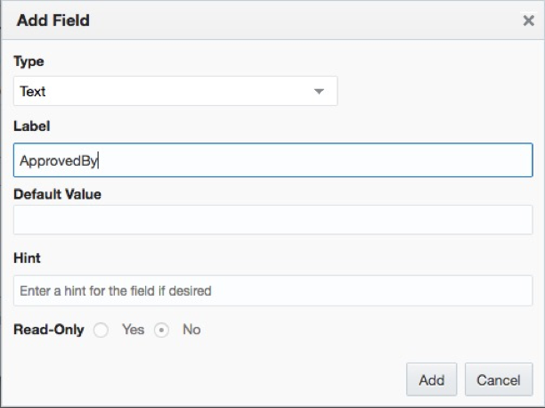

4. Repeat those steps until your form looks like

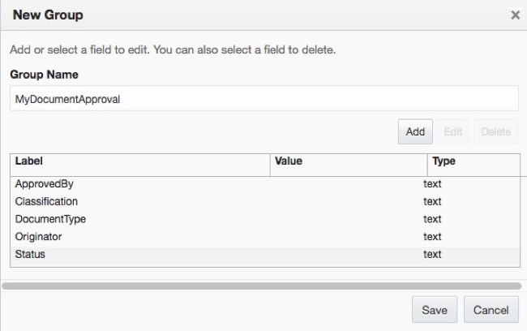

5. Save your form

Notice that you now have created a new **‘Custom Property’** called `MyDocumentApproval` with the 5 fields

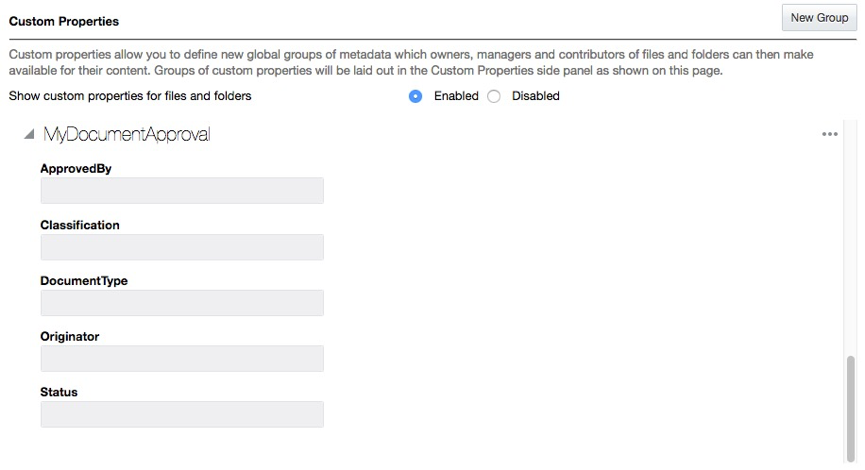
 
You are able to change your **‘Custom Property’** as an Administrator by clicking on the 3 dots on the right side of your **‘Custom Property’**

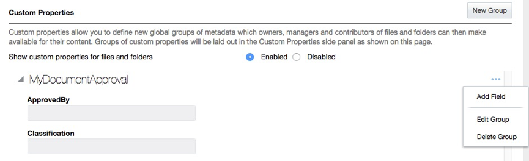

6. Please repeat the previous steps and create a new **‘Custom Property’** userXX_Digital Media with the following entries:

|Label|Default Value|Type|
|-----|-----|-----|
|Colour|Colour|text|
|Object|	|text|
|Type|Photo|text|
|Resolution|High|text|
|Creation Date|	|date|
|Camera Type|iPhone|text|

7. Your new **‘Custom Property’** userxx_Digital Media should now look like this:
 
 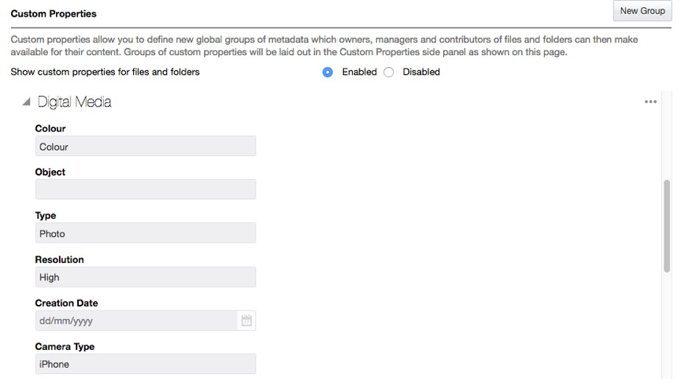

You now have finished the 1st part and have created 2 new ‘Custom Property’ called userxx_DocumentApproval and userxx_Digital Media.
In the next part we will see how to associate these ‘Custom Properties’ with content and folders.

### 6.	Working with metadata ###

If your service administrator has created custom properties (Content and Experience Cloud metadata part1), you can use this feature to quickly categorize your files and folders with additional descriptions, known as metadata. 

For example, perhaps you need to track when an item is approved by other people and who approved it. A custom property called **“Document Approval”** could be created which lists fields such as file type, the originator of the file, who approved it and when it was approved. 

You could then move all files that have been approved into one folder and apply the custom property to the folder. All the files in the folder will be identified as approved. You can edit the custom properties for the different files to show their approval date, who approved it and any other pertinent details.

People with the Owner, Manager, or Contributor role can apply custom properties to files and folders. People with the Viewer or Downloader role can view any properties that are set.

Custom Properties are available at the folder and content level once they have been associated with a folder.

### 6.1	Associate Custom Properties ###

1. Go to the Content and Experience Cloud ‘Documents’ view

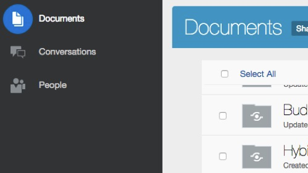

>**Note:** You might see existing folders depending on the instance and user that you are working with.

2. Click **‘Create’** on the top-level bar to create a new folder.

 
3. Enter a ``name`` for your new folder **‘Images’**. A description could be helpful for better identification of the folder purpose.

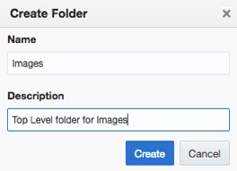

4. Click **‘Create’**. Your new folder will show up in the **‘Documents’** view.

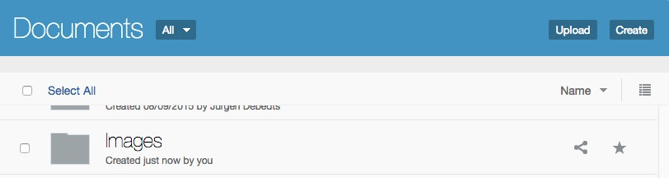

5. Go into the folder by clicking on its name. This folder has, by design, not any metadata (Custom Properties) associated to it. To assign a **‘Custom Property’** we have to go into the ``folder’s preferences``. Click on the **‘3 dots’** on the upper right part of the WebUI.

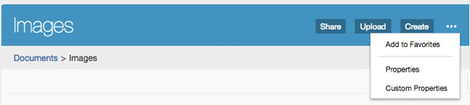
 
6. Select **‘Custom Properties’**. As this is the first time we are assigning ‘Custom Properties’ to this folder we’ll get a welcome screen

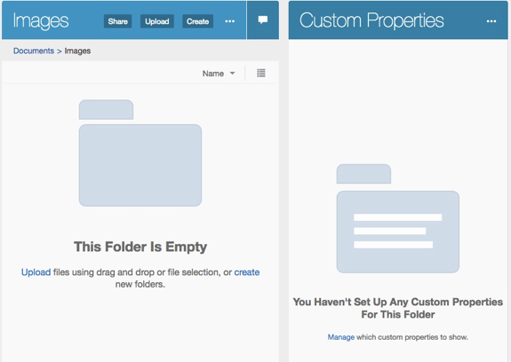
 
7. Click on **‘Manage’** to select a **‘Custom Property’** for this folder. You will be presented with a list of **‘Custom Properties’** that exists in your instance:

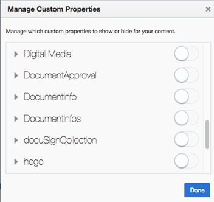
 
8. Select ``Digital Media`` by moving the slider to the right

9. **Save** your selection.

You now have assigned a metadata set ‘Digital Media’ to your folder Images.

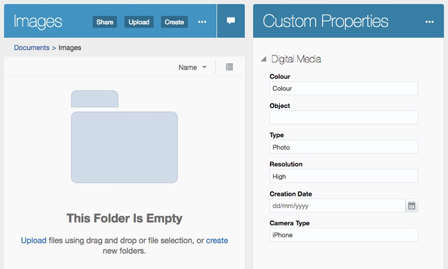

>**Note:** Custom Properties can be assigned on folder AND content level. 

``If assigned on folder level, all metadata will be inherited on the lower level subfolders AND content.
Additional Custom Properties can be assigned on individual subfolder AND content level.
However, higher level Custom Properties cannot be removed on lower level.``

10. Within this screen enter a few metadata into the fields for **‘Digital Media’and click ‘Save’**.

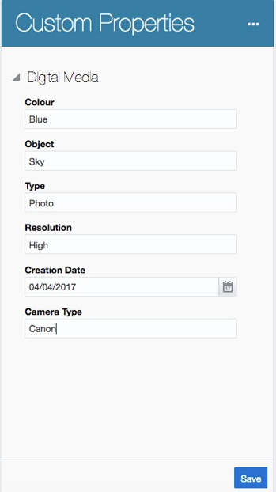

11. Next, upload an image from the **‘Upload’** button:

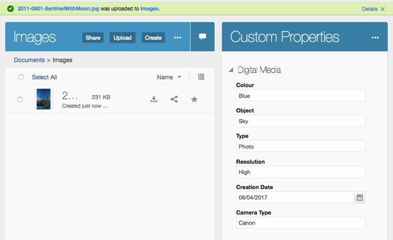

12. Click on the image to open it in the viewer.

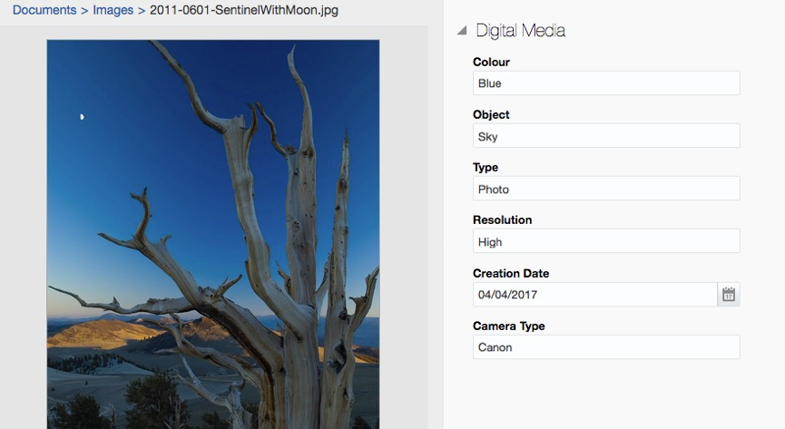

Notice that the metadata are coming from the parent level folder. Of course, you can change the values afterwards.
Please repeat the previous steps and create a folder **‘xx_Document Workflow’** (where xx stands for your participant name) and assign the Custom Property **‘DocumentApproval’** to it.

# Lab Exercise: #
[Back to CECS Cloud Test Drive Home](../README.md) | [Next: Lab 2B: Document Workflow in Content and Experience Cloud ](201-CecsPCSLab.md)

