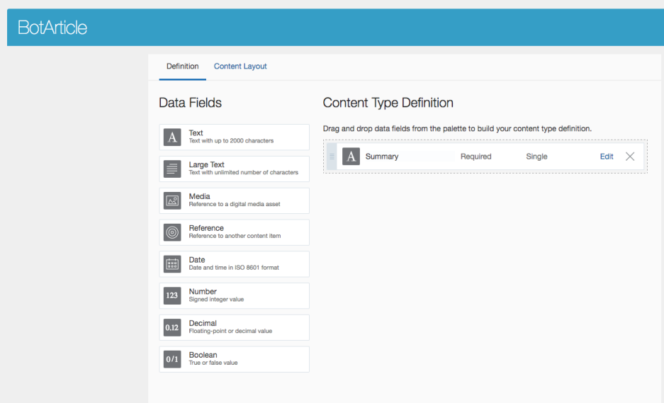
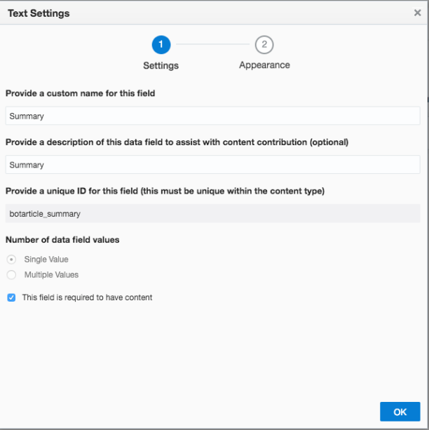
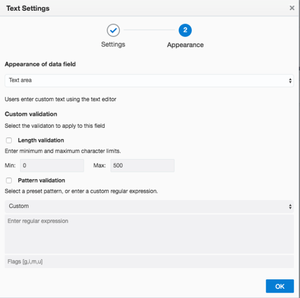
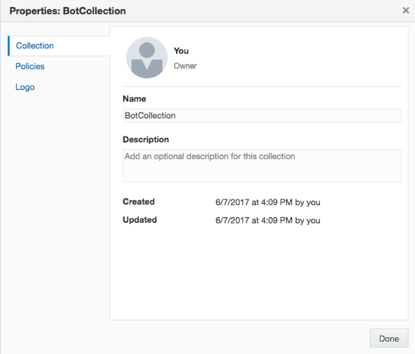
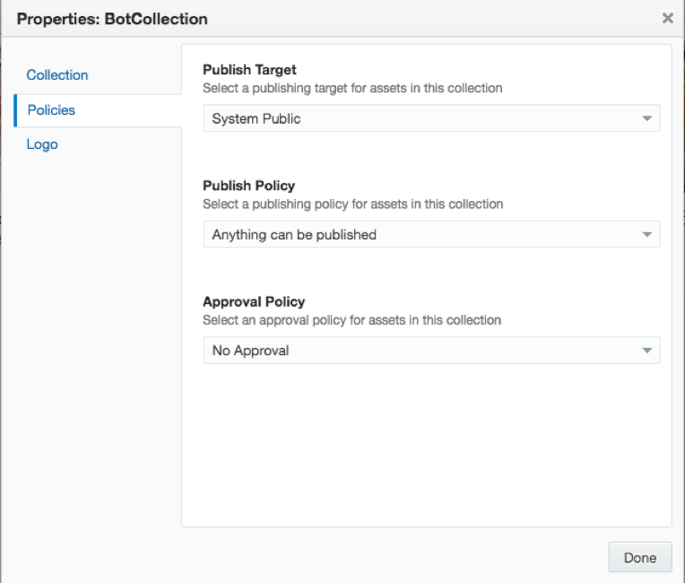

# ORACLE Cloud Test Drive #

## Lab 3: Omni-Channel Headless Content Delivery to Chatbot ##

### 1. Introduction ###

In this Lab you will be creating a chatbot that integrates with Facebook Messenger.
You will configure this bot to get the content for the messages to be sent back to the Messenger
users from CEC.

The code for the bot is provided to you. It is your task to configure the bot to get the content from
CEC and, if you want, to set up a Facebook page, add the Messenger functionality to that page
and configure the Messenger to interact with your bot.

### 2. Pre-requisites ###

TBD

### 3. Prep work ###

TBD

### 4. Setting up CEC ###

First we are going to set up some content on CEC that we can use in the bot.

#### 4.1. Create Content-Type ####

1. Create a new content type called <userid>BotArticle. Add one field to it: ``Summary`` (<userid>botarticle_summary).

#### 4.2. Create a Collection ####

1. To publish our content so it can be consumed by the bot, we need a Collection. Create a collection
called **“<userid>BotCollection”** and set it to the Publish Target “System Public” and Set the

2. **Publish** and **Approval publish** so that no approval is required to publish an item.

#### 4.3. Create some content ####

Now we are going to create two content items of the content type we just created: BotArticle.
Make sure that when you create the items you select the <userid>BotCollection as the Collection

|Attribute|Value|
|---:|---|
|Title:| “Barista of the Month”|
|Summary:| “Meet Kirk, our barista of the month who works out of our Seattle Madison Park coffeeshop. His love of coffee started early, and he wants to share everything he knows with you. Learn anything from designing latte art to perfecting your coffee brew. Find out what his favorite coffee and ice cream pairing is. Visit Kirk today our flagship Cafe Supremo coffeeshop in Seattle and ask him anything.”|

|Attribute|Value|
|---:|---|
|Title:| “Sustainable Coffee”|
|Summary:| “Our coffee comes from South American regions where we have a strong commitment to supporting the farming communities that supply our coffee, tea and cocoa, and other agricultural products. Experience our famous Aroma coffee roast today.”|

#### 4.4. Publish ####

1. Publish the two content items.

### 3. Setting up the bot ###

TBD

### 4. Run the Scenario  ### 

TBD

### Congratulations you have completed the Lab! ###

# Lab Exercise: #
[Back to CECS Cloud Test Drive Home](../README.md)
