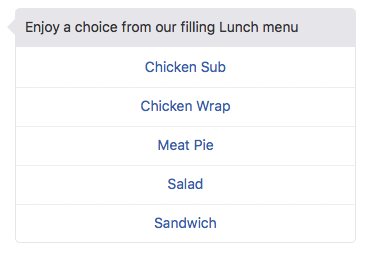

# ORACLE Cloud Test Drive #

## Lab 3: Custom Components ##

### Introduction ###

For a Chatbot to add value to a conversation, it must be able to return current and valid data in response to a Question.  That is, ultimately it will need to integrate into an organisation’s back end data store (the system of record) that holds the information required; such as banking information, employee information from a HR application or sales information in a Sales CRM system. 

The Oracle Intelligent Bot Platform integrates with back end data through the use of custom conversation states – known as custom components- that allow for a simple declarative reference to the data and/or process on that data (such as “getAccountBalance”). 

Furthermore, the use of “Custom Components” allows for a “separation of skills” between the Dialogue developer and those tasked with retrieving the data from the backend application.  That is, business personnel can focus on the nature of the conversation flow (declarative in nature), whilst professional developers can orchestrate the data access via the built-in integration to the Oracle Mobile Cloud, Enterprise (OMCe).

The Intelligent Bots Platform uses the “Custom Component Service” framework, within OMCe, to leverage Custom and Mobile Platform APIs to both integrate with the Systems of Record and utilize mobile-first platform services, like Push Notifications (enabling asynchronous messages to the user).

#### Custom Component Service - Separate Dialog from Data Access ####

  NOTE: Custom Components are exposed to the Dialog flow as REST based micro-services and while they may be developed in any language, the use of NODE.js and the associated JavaScript SDK is by far the easiest way to do so.
  
In this Lab Session, you will be seeing how the use of a Custom Component will allow for:
 - The dynamic retrieval of data from a backend application
 - The inclusion of additional, UI capabilities to improve the user experience 
 
#### Static Menu converted to Dynamic, Visualisation via Custom Components ####

<table width="75%" border="0">
  <tr>
    <td align="Center"></td>
    <td width="20%">Converted to =></td>
    <td align="Center"></td>
  </tr>
</table>

### Hands On Lab ###

This lab is broken into two distinct paths, based on the persona of the user and their skillset.

[OPTION 1](301-IB.md): Intended for “non-technical Bot-Builders”; it looks at the steps required register a component and to quickly and easily integrate data into their conversation flow.  It covers:
 * Registering a custom component from OMCe into the Bot Platform.
 * Modifying the dialogue flow to show how easy it is to integrate the call to the Backend application into the conversation
 * Seeing how the use of Custom Components allows for 
    * The simple retrieval of data from a backend application
    * The use of additional, UI capabilities to improve the user experience 

[OPTION 2](302-IB.md):  Intended for “Professional Developers” who will creating the custom components and hence will need to understand the basic structure of the Components deployed to the Oracle Mobile Cloud.  
This option adds additional steps over [OPTION 1](301-IB.md) by adding the following:
 * Reviewing the structure of a Node.js based Custom Component implementation through the customisation of a pre-built Component.
 * Creating a Custom API within the Mobile Core Services (MCS) of the Mobile Cloud environment to represent the Custom Component.
 * Deploying the personalised Custom Component implementation to the Node engine running inside the OMCe environment. 

## Click on your chosen Option path below ##
- [Option 1: Integrate a pre-built Custom Component into your Digital Assistant](301-IB.md)
- [Option 2: Create a Custom Component and integrate into your Digital Assistant](302-IB.md)

# Lab Exercise: #
<< [Back to Digital Assistant Test Drive Home](../README-ODA.md)
