# ORACLE Cloud Test Drive #

## Lab 3: Custom Components ##
<< [Back to Custom Components Introduction](300-IB.md)

### CREATE THE CUSTOM COMPONENT API in MCS AND REGISTER WITH ODA ###

#### Lab Pre-Requisite ####
For this exercise you will be altering a template custom component, which will need to download and then modify with you favourite Text Editor.

Download the following to a convenient location and unzip the archive to access the various files being used in the exercise:
 - [Custom Component Template](Lab_Files/Custom-Component-Template.zip)


### STEP 1 CREATE THE CUSTOM COMPONENT API ###

You will be creating a custom API in MCS to act as the custom component for the Bot Dialog Flow.
To simplify this exercise we will use a **“Starter kit”** which contains a predefined component.

This Starter Pack will need to be updated with the name for the API definition you will use. 

**NOTE:** You must be consistent with the naming and use of CASE. Throughout the exercise where prompted to replace a value in square brackets ``[xxx]`` include the brackets ``eg _[xxx] => _YYY``

```javascript
<API-NAME> = “CafeSupremoTD_[YOUR INITIALS]”
```

1. Rename the Starter Kit folder (this represents the node.js package)

Eg.
<table width="50%" border="0">
  <tr>
    <td align="Center"></td>
    <td>Rename to =></td>
    <td align="Center"></td>
  </tr>
</table>

2. Open the folder and rename the **``NAME-OF-API.raml``** and **``NAME-OF-API.js``** files in the same way .

3. Open the newly renamed RAML file and edit the name references within the file (at the top of the file)

```yaml
#%RAML 0.8
# This RAML describes the Bots component service REST API contract.
# The OMCe custom API as specified by this RAML, will implement the Bots Component Service.
title: [NAME-OF-API]
version: 1.0
baseUri: /mobile/custom/[NAME-OF-API]
```

4. Edit the package.json file and update the API name references

```javascript
{
"name" : "[NAME-OF-API]",
"version" : "1.0.0",
"description" : "Bots OMCe component for TD2",
"main" : "NAME-OF-API.js",
"repository": {},
…
```

5. Edit the renamed **``NAME-OF-API.js``** file and update the URI reference at the top of the file.

```javascript
const apiURL = '/mobile/custom/NAME-OF-API/components';
```

6. Login to the MCS instance as the **``TestDrive``** user (the Base URL & current password will be given to you by the facilitator)
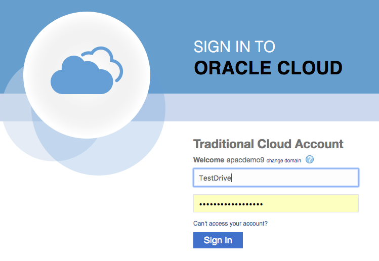

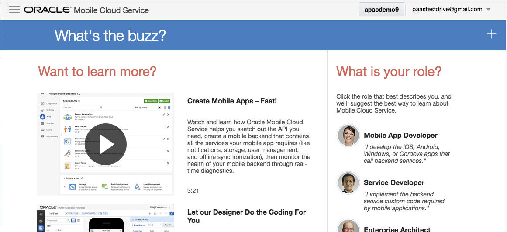

7. Click on the "Hamburger Menu" at the top of the page to expose the MCS Function Menu.


Expand the **Development** accordion by clicking on the down arrow (V) 

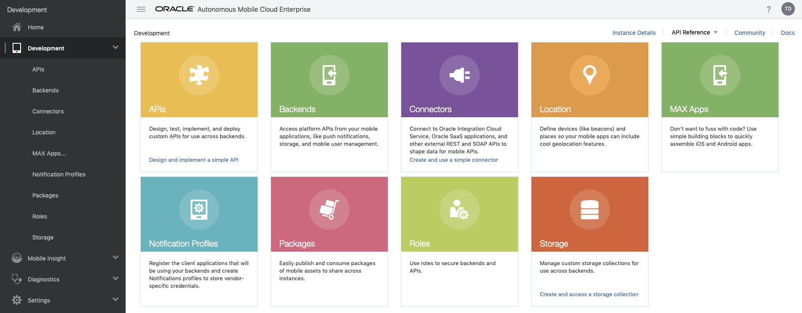

Click on the **Backends** Sub Menu (Under Development).

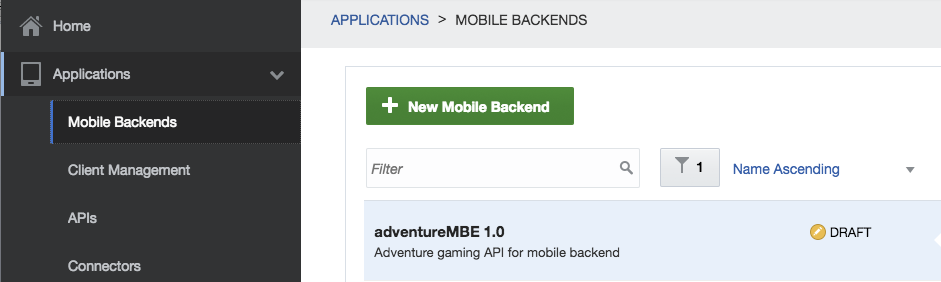

8. Click on the ``[+ New Mobile Backend]`` button to create a new Mobile Backend. 
 - Enter the MBE Name: **``CafeSupremoTD_MBE_[Your Initials]``**.  
 - Enter a Description : "Mobile Backend for APIs to expose the required backend data for the TD Digital Assistant"

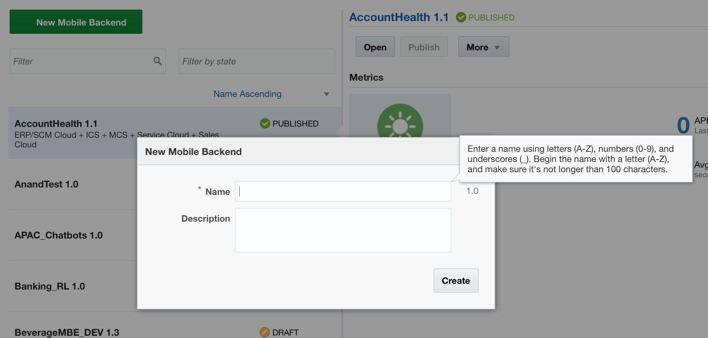

9. After the Mobile Back End (MBE) is created, Select The **``Settings``** Sub-menu under the newly created Mobile Back End.

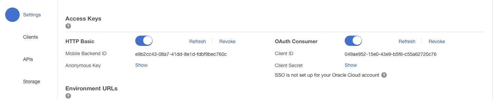

Click the **``Show``** link next to the **Anonymous Key** label to show the Public authentication Token for the MBE.


Copy the **``Mobile Backend ID``** and the **``Anonymous Key``** to a text editor for use later.

10. Click the **``APIs``** link in the main menu to show the currently defined Custom APIs page (standard API).

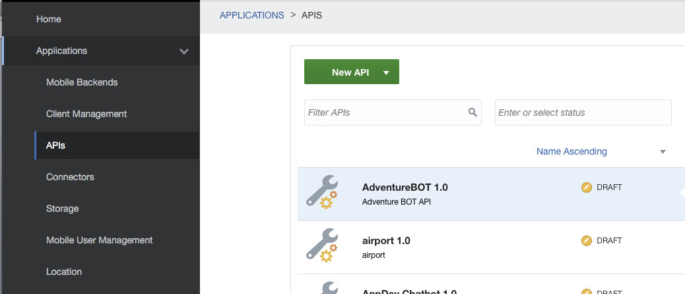

and select ``[New API]`` => ``API`` (**NOT Express API**)


11. Drag your Renamed RAML file from the Project Folder onto the Dialog Box's Drop area to create the API
definition

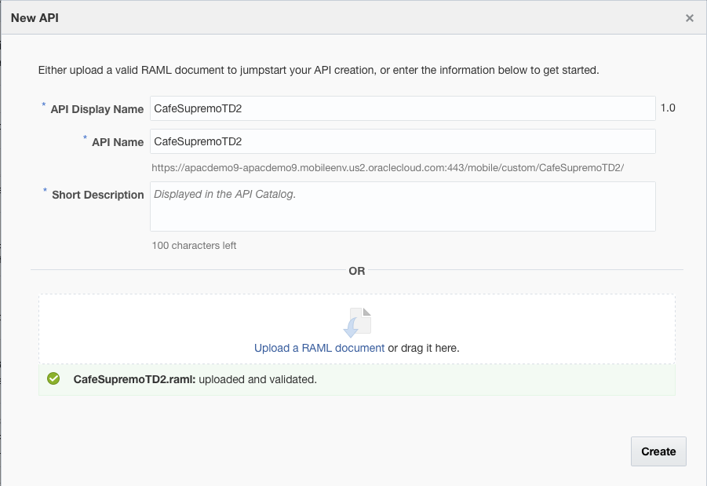

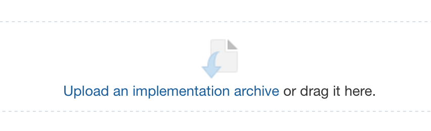

- Add a decription of the API in the **Short Description** field. Eg. "Custom Component API for TD Digital Assistant".
- Click **`[Create]`**

12. Once the API has been created, open the ``General`` if it is not the default (should be on this tab after creating the new API)

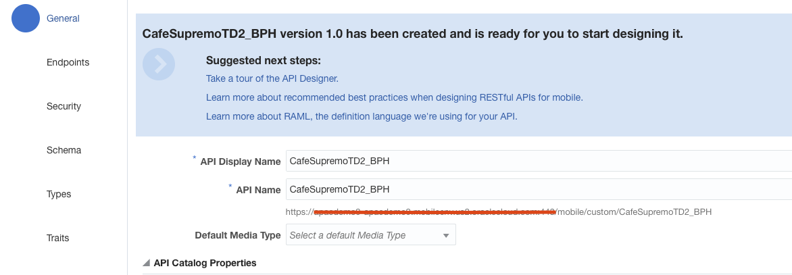

Copy the API base URL (under the API Name field) and copy it to a text Editor for future use (similar to MBE and Anonymous Key).

13. Click on the ``EndPoints`` Sub menu and confirm the confirm the creation of the following Resource Endpoints

- /components
- /components/[componentName]


eg.
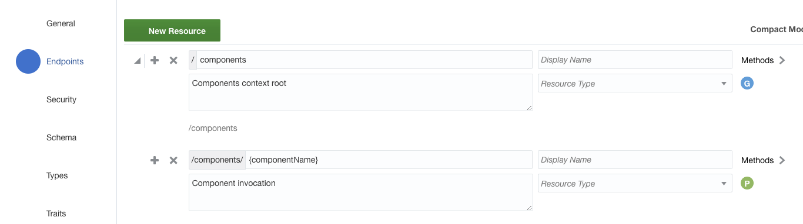

14. Change to the Security Tab and turn OFF the ``Login Required`` security option using the Toggle Switch as shown.

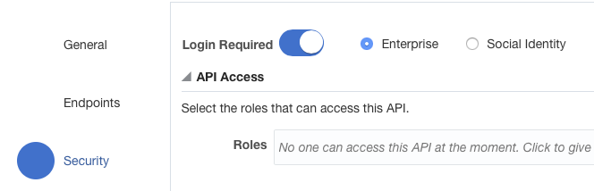

to

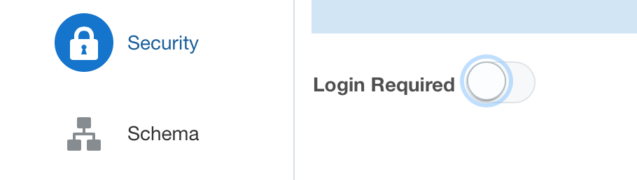

- Click **`[Save]`**

15. Now Zip up the entire package directory

Eg.
<table width="50%" border="0">
  <tr>
    <td align="Center">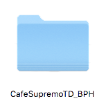</td>
    <td>COMPRESS =></td>
    <td align="Center">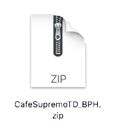</td>
  </tr>
</table>


16. Return to the Mobile Cloud Service Dashboard.  

With the API page for your API open, Change to the **Implementation** Tab (2nd from Bottom) 

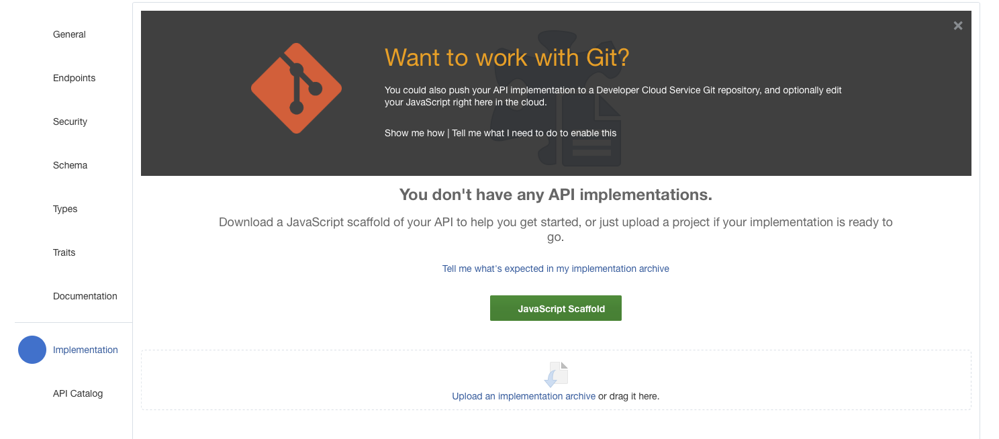


and drag the Zip file onto the “Drag-n-Drop” box to create an Runtime implementation in the embedded Node.js engine.


17. Confirm that the API loaded and was validated successfully.

18. Test the functionality of the Loaded API by clicking the ``[TEST]`` button (top right corner)


- Set the **Backend** as the one you created in the first Step. 


- Set the **Authentication Method** as the "**Current User**". 


- Press ``[TEST]``

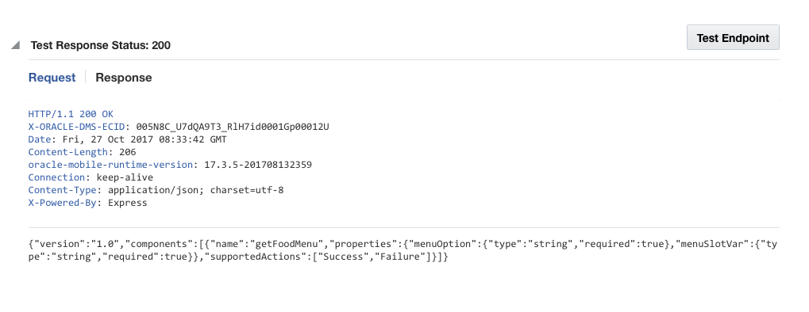

A successful call to the Service will result in a Status code of **200** as well as a JSON payload containing the metadata block describing the service.

19. Register the new API with the Mobile Backend.

- Open the Mobile Backend defined earlier and click on the **APIs** submenu.

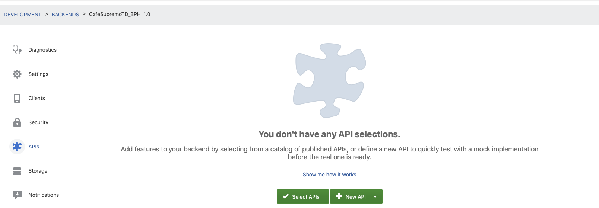

- Click on the **``[Select API]``** button to bring up the catalogue of available APIs.

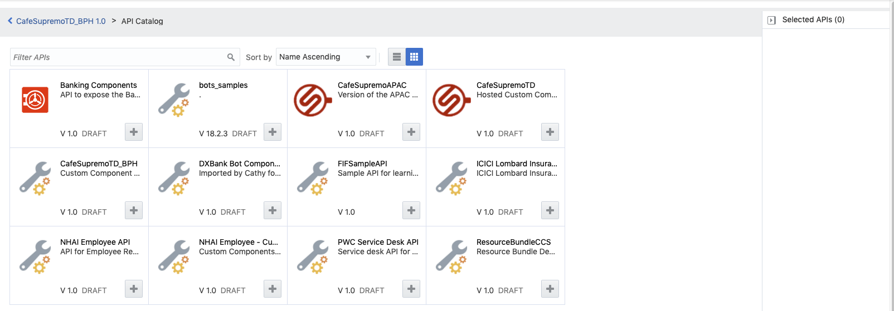

- Find your API in the catalogue and click on the **``[+]``** to associated it with your defined Mobile Backend.

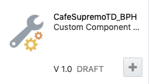

- Confirm the API has been associated with the Mobile Backend

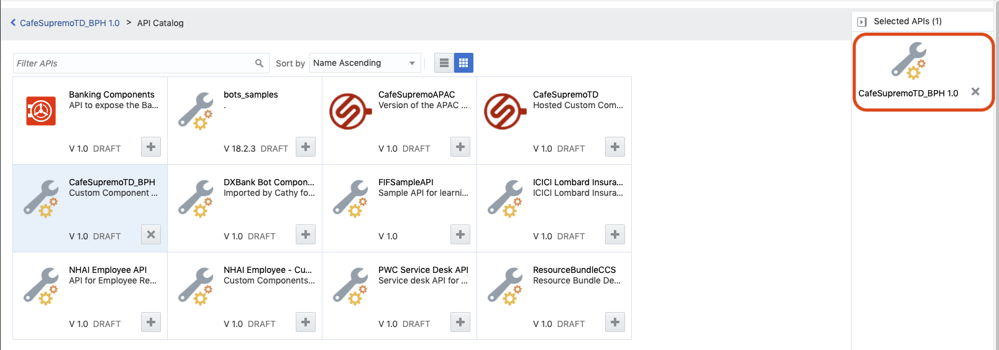

- Click back to **Home** in the main menu.


### STEP 2 REGISTER THE CUSTOM COMPONENT WITH THE DIGITAL ASSISTANT ##

1. Return to the Digital Assistant Builder (Reopen your Bot if it had been closed)

2. Click on the Component Service Icon to access the Custom Component Service Page


Click the **``[+ Service ]``** button to define a new Custom Component Service for your Bot.


3. Fill in the fields with the following details.


<table width="50%" border="0">
  <tr>
    <td>Name:</td>
    <td>CafeSupremoTD_CC_[YOUR INITIALS]</td>
  </tr>
    <tr>
    <td>Description:</td>
    <td>A Custom Component to retrieve menu Information from the Backend.</td>
  </tr>
  <tr><td colspan=2></td></tr>
  <tr>
    <td colspan=2>(*) Mobile Cloud ( ) Other</td>
  </tr>
  <tr>
    <td>Backend ID:</td>
    <td>The Backend ID you copied in Section 1 - Step 9</td>
  </tr>
  <tr>
    <td>MetaData URL:</td>
    <td><strong>[The API BaseURL copied previously]/components</strong>   - the /GET method resource</td>
  </tr>
  <tr><td colspan=2></td></tr>
  <tr>
    <td colspan=2>[X] Use anonymous access</td>
  </tr>
  <tr>
    <td>Anonymous Key:</td>
    <td>The Anonymous Key value copied in Section 1 - Step 9</td>
  </tr>
</table>

**NOTE:** Make sure you select *``Mobile Cloud``** and *``Use Anonymous acces``** options.

Click **``[Create]``** button to register the component service.

4. Once the component service is registered, the components available for use in the dialogue flow will be displayed.  
- Click on the ``CafeSupremoTD_CC_xxx`` service entry to expose the individual component **getFoodMenu**.
- Click on the ``getFoodMenu`` entry to see the required properties and the supported actions from the component.


5. Return to the Dialog Tab by selecting the Dialog icon.


Scroll down to find the following YAML fragment

```yaml
# #########################################################################################
# TEST DRIVE LAB 3: Custom Component
#
# Dynamically show the Appropriate Menu, based on the selected food requirement.  
# This one component replaces the original (multiple) hard coded menu states below. 
# #########################################################################################
 
#  showMenu:
#    component: "getFoodMenu"
#    properties: 
#      menuSlotVar: "menuItem"
#      menuOption:  ${menu.value}
#    transitions:
#      actions:
#        Success: "getFoodHeatedOption"

#        Success: "wasSandwichChosen"
# (Replace success Action in Lab 4 => "wasSandwichChosen")
# #########################################################################################

```

This references the Custom Component you just registered and dynamically returns data from the online menu system, while also removing the need for the various additional menus (as well as introducing a different UI for the Menu).

6. Remove the **``"#"``** from the beginning of all lines between **``showMenu to Success``** inclusively.

<table width="75%" border="0">
  <tr>
    <td>
    <pre>
#  showMenu:
#    component: "getFoodMenu"
#    properties: 
#      menuSlotVar: "menuItem"
#      menuOption:  ${menu.value}
#    transitions:
#      actions:
#        Success: "getFoodHeatedOption"
    </pre>
    </td>
    <td width="20%"><strong>Converted to =></strong></td>
    <td>
    <pre>
showMenu:
  component: "getFoodMenu"
  properties: 
    menuSlotVar: "menuItem"
    menuOption:  ${menu.value}
  transitions:
    actions:
      Success: "getFoodHeatedOption"
    </pre>
    </td>
  </tr>
</table>

7. Run the Bot again in the “Bot Tester” to see the impact of the Custom Component.  In this case the component is generating a UI based on the Oracle Bot Common Message model, which allows for the development of sophisticated user interactions that run across Multiple Channels (but take on the look and feel of the channel).  

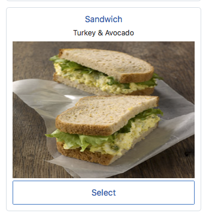

In [Lab 4](400-IB.md), you will learn to configure the Bot to use a "**Instant App**" to build a Wizard to design a sandwich.


## END OF HANDS-ON ##


# Lab Exercise: #
<< [Back to Digital Assistant Test Drive Home](../README-ODA.md)
