# ORACLE Cloud Test Drive #

## Lab 4 Instant Apps for Structured Data ##

### Introduction ###

While a conversational interface is a natural metaphor for interacting with the backend data and processes, the need to input a larger amount of static data makes this mechanism a lot more cumbersome and difficult as part of a Question / Answer conversation. 

Rather than being forced to respond to multiple (often repetitive) questions, each to return the appropriate data value, it would be more efficient and intuitive to use a traditional Form Style interface to input the data in a single step.

The Oracle Intelligent Bot Platform addresses this issue through the use of “Instant Apps”; which are rich, interactive widgets that can be embedded in the conversation at the point where a more sophisticated user interface is required.

By incorporating an “Instant App” into the dialogue flow, you will be able to collect the required structured data using a Form interface, that uses standard UI elements (Text Fields, Pop-Lists, Radio Buttons, Check Boxes etc.) and after any required validation, pass it back into the dialog as a single conversation step.


In this Lab Session, you will be:

 - Reviewing the “Instant App” Builder and the available UX functionality by the cloning of a template app:

<table width="50%" border="0">
  <tr>
    <td align="Left">
    <ul><li><B>Design My Lunch:</B></li></ul><br>
    A simple Form style Interface to determine the customer’s preferences out of the many options available when ordering a Sandwich. <BR>
    </td>
    <td align="Center">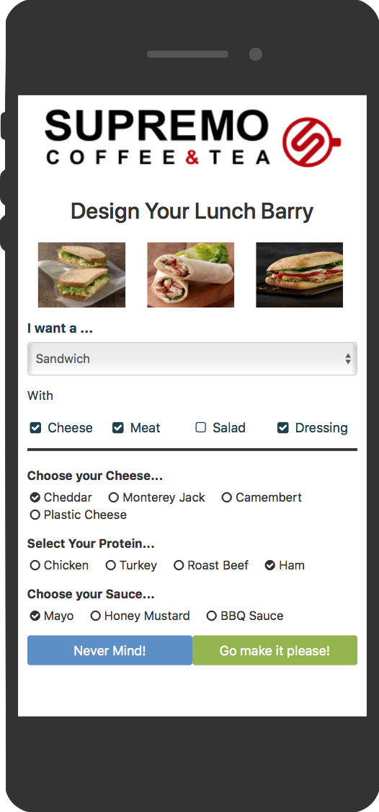</td>
  </tr>
</table>

 - Incorporate the new "Instant Apps" into the Cafe Supremo conversation flow, through use of the **_System.Interactive_** Component, passing in relevant information from the Flow (in this case the Current User’s Name) and returning the submitted form input back into the conversation.


### Exercise Steps ###

1. Access the Oracle Mobile Cloud Bot builder UI using the following URL

http://{hostname:port}/botsui/bot

Your instructor will give you the cloud server host name to use.

2. Click the Instant App Button in Header to open the Oracle Instant App Builder


3. The Builder has a number of mechanisms to start to build an “Instant App”

 - Starting with a “Blank Canvas”
 - Basing The Design on a Use Case template
 - Importing the Instant App Source File (JSON)
 - Cloning a previously Built Instant App

Click on the **“New Instant App”** Button to See the Create App Page.

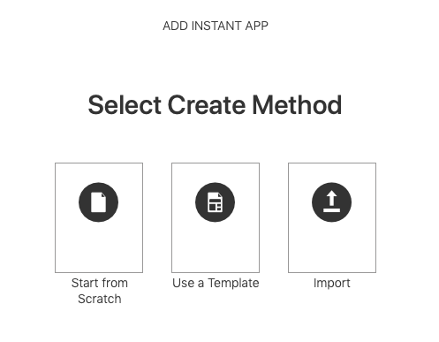

Where we can see a number of options for creating new applications.

Click on **Use a Template**


4. In this case we will start by cloning a partially complete Instant App.  So return to the Main Page by either clicking the “Cancel” button.

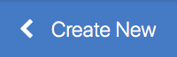

5. Scroll Down to find the “CafeSupremo : Design My Lunch” Instant App.

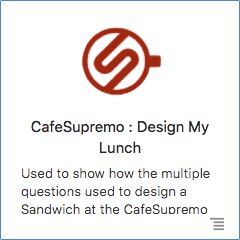

**NOTE** if the Specified Instant App is not currently available in your instance, it can be obtained [here](Provisioning/CafeSupremo_DesignMyLunch.json). To import the application select **`Add Instant App`** then **`import`** from within the Oracle Instant App Builder.

6. Click the Menu Icon (Botton Right of box) and select “Edit a Copy”

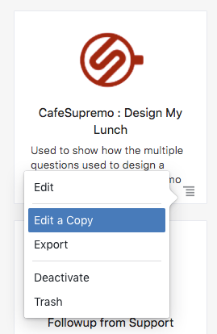


7. Rename the Instant App from “Copy of CafeSupremo : Design My Lunch” to “CafeSupremo : Design My Lunch [Your Initials]”

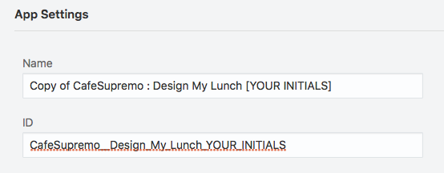

Take Note of the Instant App ID – you will need this value to integrate with the Bot.

8.Click on Layout Tab to show the layout of the current panel (“MySandwichOptions”) and the available UI elements.

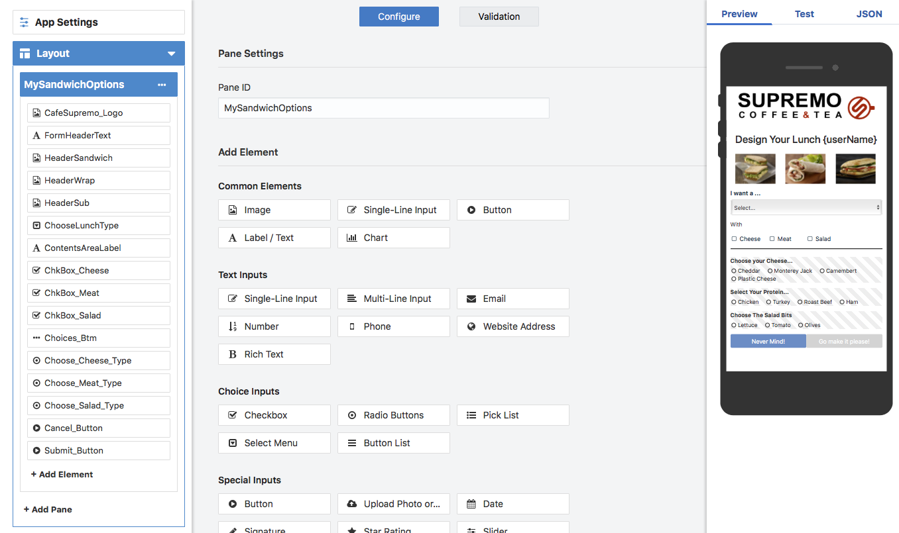

9. We want to add a dressing option to the Sandwich

Drag a Checkbox below the “ChkBox_Salad” checkbox element in the MySandwichOptions pane in the left panel of the builder.


10. Click on the new Checkbox element and update the properties as indicated.

<table width="50%" border="0">
  <tr>
    <th>Property</th>
    <th>Value</th>
  </tr>
  <tr>
    <td>Element ID</td>
    <td>ChkBox_Dressing</td>
  </tr>
  <tr>
    <td>Label</td>
    <td>Dressing</td>
  </tr>
</table>

11. Click the Style Button at the top of the Element Details.

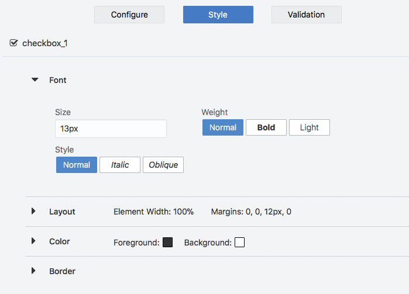

12.	Expand the Layout Accordion to set the Width of the Checkbox (by default the size is set to 100% of the width of the Panel)


 - Set the width to 25%

NOTE. Setting the Element Width to 25% allows the new checkbox to be inline with the other options

13.	Click on the “MySandwichOptions” Pane header to again show the element options available.

14.	Drag a RadioButtons Element radio group beneath the “Choose_Salad_Options”  Radio Buttons Element in the “MySandwichOptions” Pane.

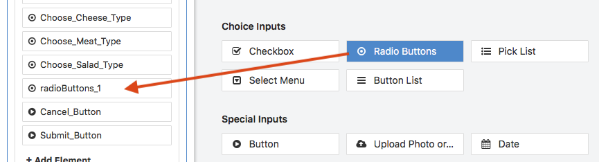

15.	Click on the new Radio Buttons Element in the MySandwichOptions Pane to display its Properties.

16.	Set the Element Properties as indicated.

<table width="50%" border="0">
  <tr>
    <th>Property</th> 
    <th>Value</th>
  </tr>
  <tr>
    <td>Element ID</td>
    <td>Choose_Dressing_Type</td>
  </tr>
  <tr>
    <td>Label</td>
    <td>Choose Your Sauce...</td>
  </tr>
    <tr>
    <td>Initially Visible</td>
    <td>UNCHECKED</td>
  </tr>
    <tr>
    <td>Display Items Inline</td>
    <td>CHECKED</td>
  </tr>
</table>

17.	Add an additional Radio Button to the new “Choose_Dressing_Type Radio Group. By clicking on the “+ Add Radio Button” link


18. Set the Radio Button Labels and Values as indicated:

<table width="50%" border="0">
  <tr>
    <th>Radio Button</th>
    <th>Label</th>
    <th>Value</th>
  </tr>
  <tr>
    <td align="center">1</td>
    <td>Mayo</td>
    <td>MAYO</td>
  </tr>
  <tr>
    <td align="center">2</td>
    <td>Honey Mustard</td>
    <td>HONEY_MUSTARD</td>
  </tr>
    <tr>
    <td align="center">3</td>
    <td>BBQ Sauce</td>
    <td>BBQ</td>
  </tr>
</table>

19. We want the new “Choose_Dressing_Type” options to be visible when the user selects the Dressing CheckBox (and disappear when un-selected). 

- Click the Events and Actions Button on App Menu to see the various Application and Element events that are defined for the application (based on what elements have been added to the App pane)

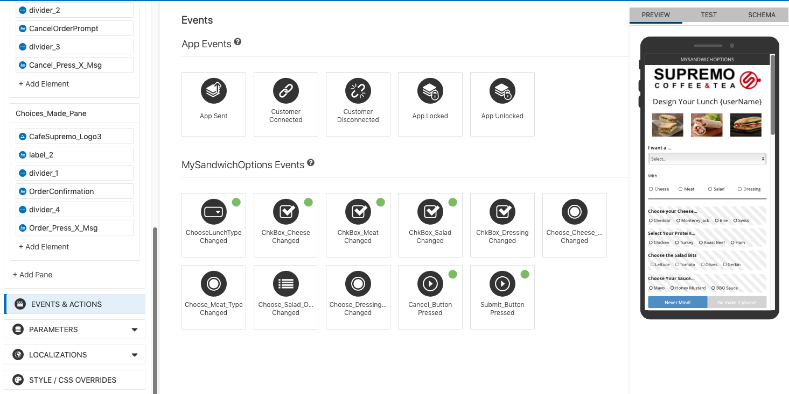

NOTE: The Green Dot indicates where an Event Condition/Action has currently been applied.

20. Click the event associated with the ChkBox_Dressing element. (ChkBox_Dressing Changed)


21. Choose “ when value changes to true” from condition Pop-list.

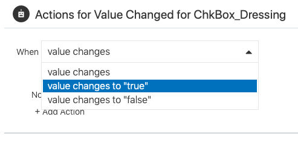

22. Click  the `+ Add Action` link to associate a specific action (S) to the specified event.


 - Select the “**Make Elements Visible**” Tile to specify which elements will be effected by this event


23. Drag the “**Choose_Dressing_Type**” Radio Button element from the list of available elements and drop it on the “Action: Make Elements Visible” drop target for the action.

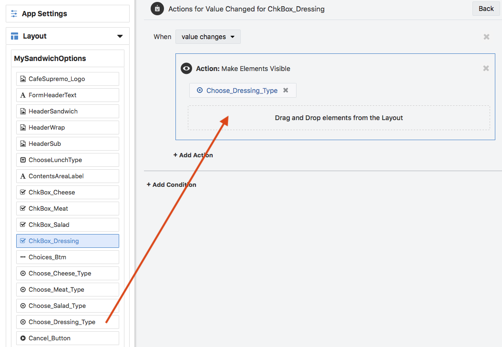

 - Click the `+ Add Condition` link to add a different event handle to the element.
 

 - Choose “ when value changes to false” from condition Pop-list.
 

 - Add actions “Make Element Invisible” and “Reset Elements” to the condition (you will need to do one at a time).

 - Drag the “Choose_Dressing_Type” Radio Buttons Element onto both actions.

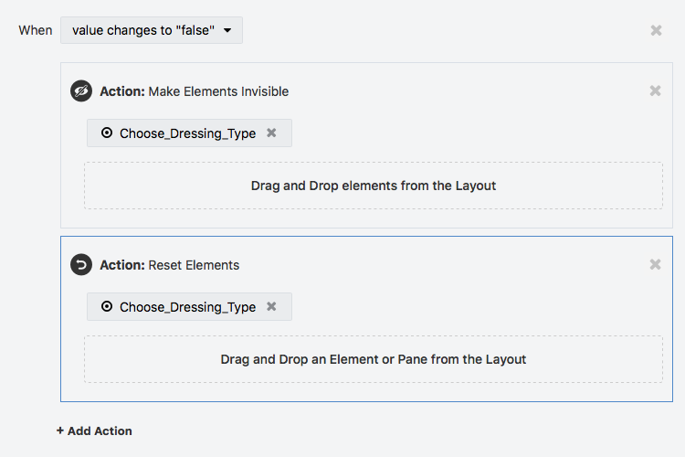

24.	Return to the “Events And Actions” page by either clicking the “Events and Actions” Menu Item or the [Back] button at the top right of the Event condition Property Sheet.

25.	Click on the “Submit_Button_Pressed” tile to add events, conditions and actions to the button.

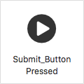

 - Click the `+ Add Condition` Link to add a specific action to the button when it is pressed
 
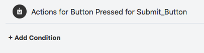
 
 - Choose the “when button is pressed regardless of validation” option from the condition drop down list.
 
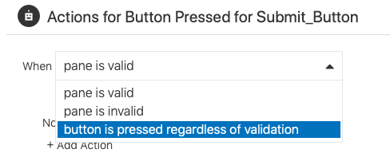
  
 - Click the `+Add Action` link to add the required Actions when the button is pressed.  
 
 - Select the “**Exit to Bot**” Tile to add this action to the button.
 
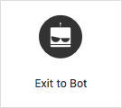
 
26.	Click the `+Add Action` again to add a second parallel action to the button

 - Select the “**Activate and Show Pane**” Tile to add this action to the button.
 


 - Drag the “Choices_Made_Pane” header onto the Drop Target of the Action.  
 
 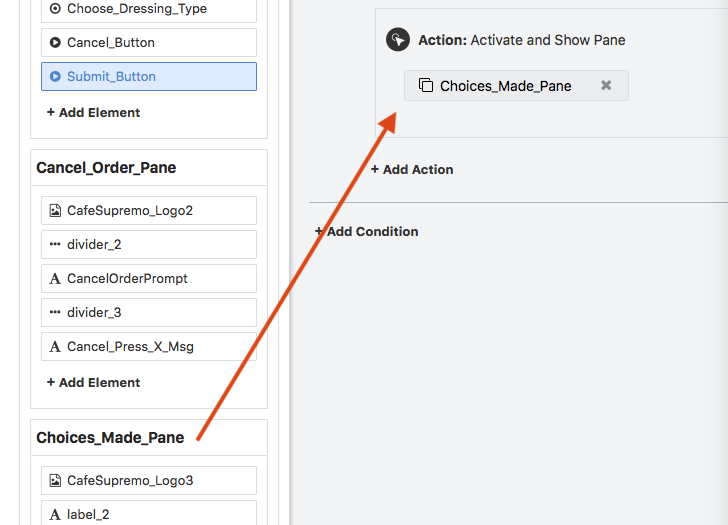
 
 NOTE: This Pane will be used as a simple confirmation page to confirm the components ordered.
 
27.	We need to define which information is to be passed back to the Bot’s Conversation flow.  This is done by adding the required information as Parameters to the “Exit To Bot” Action created in step 25

 - Click the `+ Add Parameter` to add six (6) outbound parameters to the Action
 
  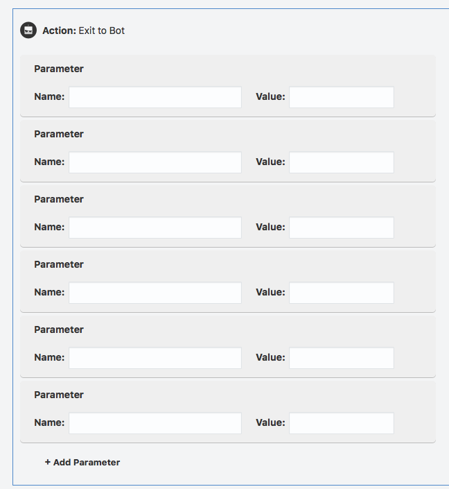
  
 - Add the Parameter Details as indicated:
 
 <table width="50%" border="0">
  <tr>
    <th>Parameter Name</th>
    <th>Parameter Value</th>
  </tr>
  <tr>
    <td>ORDER_ACTION</td>
    <td>SUCCESS</td>
  </tr>
  <tr>
    <td>SANDWICH_TYPE</td>
    <td>{ChooseLunchType}</td>
  </tr>
  <tr>
    <td>CHEESE</td>
    <td>{Choose_Cheese_Type}</td>
  </tr> 
    <tr>
    <td>MEAT</td>
    <td>{Choose_Meat_Type}</td>
  </tr> 
    <tr>
    <td>SALAD</td>
    <td>{Choose_Salad_Options}</td>
  </tr> 
    <tr>
    <td>DRESSING</td>
    <td>{Choose_Dressing_Type}</td>
  </tr> 
</table>
 
 NOTE: The use of “Curly Braces” {x} is used to reference the value of the respective Form Element.

28.	Save the Instant App and return to the Oracle Bot Builder.

29.	Open the “**Café_Supremo_TD_[YOUR INITIALS]**”  Bot that you had created earlier, if it is not currently open in the Bot Builder

30.	Select the Dialog Tab in the left hand toolbar (3rd Icon) to open the Dialogue flow in the BotML Text Editor.

  
  
31.	Scroll down to find the Conversation Step (or "State") which activates the Instant App Sandwich Wizard

 NOTE: In this case the Step is named “**designYourLunch**” and is defined as a **_System.Interactive_** component.

```yaml
  wasSandwichChosen:
    component: "System.ConditionEquals"
    properties:
      variable: "menuItem"
      value:    "Sandwich"
    transitions:
      actions:
#        equal:    "designYourLunch"
        notequal: "getFoodHeatedOption"

# #########################################################################################
# TEST DRIVE LAB 4 : Instant Apps for Structured ContentCustom Component 
#
# Add a Sandwich design Wizard to the conversation allowing user to specify their Sandwich
# Content.
#
# The input and subsequent Output from the Sandwich Wizard are defined in the properties
# of the system.interactive Component.
# 
# Properties
# sourceVariables : information being passed to the Instant App (in this case the userName)
# variable        : payload coming back from Instant App is copied to this variable
# ID              : The id of the Instant App to be called from the Bot.
# #########################################################################################
        
#  designYourLunch:
#    component: "System.Interactive"
#    properties:
#      sourceVariableList: userName
#      variable: lunchOrder
#      id: [ID OF YOUR INSTANT APP]  
#      prompt: "Please click on the Link below to go to the Sandwich design wizard" 

# ######################################################################################### 
```
**Note:** 
  -	The “sourceVariables” property is used to pass one (or a list) of values as input parameters of the Instant App.
  -	The “variable” property references a dialogue context variable to which the payload coming back from the instant app 

 - Update the ID property with the Instant App ID for your version of the Instant App
 
(eg. CafeSupremo__Design_My_Lunch_YOUR_INITIALS)

 - Remove the “Comment Hash” (#) from the beginning of each line in the designYourLunch state. (from “designYourLunch” line to the prompt: line - inclusive) 
 
```yaml
#  designYourLunch:
#    component: "System.Interactive"
#    properties:
#      sourceVariableList: userName
#      variable: lunchOrder
#      id: [ID OF YOUR INSTANT APP]  
#      prompt: "Please click on the Link below to go to the Sandwich design wizard" 
```
Convert To..

```yaml
  designYourLunch:
    component: "System.Interactive"
    properties:
      sourceVariableList: userName
      variable: lunchOrder
      id:  CafeSupremo__Design_My_Lunch_YOUR_INITIALS  
      prompt: "Please click on the Link below to go to the Sandwich design wizard" 
```

 - Remove the additional "Hash" (#) for the **equal:** action of the **wasSandwichChosen** state that is immediately above the **designYourLunch** state

```yaml    
  wasSandwichChosen:
    component: "System.ConditionEquals"
    properties:
      variable: "menuItem"
      value:    "Sandwich"
    transitions:
      actions:
#        equal:    "designYourLunch"
        notequal: "getFoodHeatedOption"
```
Convert To...

```yaml
  wasSandwichChosen:
    component: "System.ConditionEquals"
    properties:
      variable: "menuItem"
      value:    "Sandwich"
    transitions:
      actions:
        equal:    "designYourLunch"
        notequal: "getFoodHeatedOption"
```

 32. Replace the “success” action transition in the **showMenu** conversation State (as used in Lab 3).  Replace “**getFoodHeatedOption**” with a reference to “**wasSandwichChosen**".
 
 This change, directs the dialogue flow to a simple test to see if the end-user selected a Sandwich from the menu.  If this is the case, the flow is directed to the "designYourLunch" instant App
 
 ```yaml
   showMenu:
    component: "getFoodMenu"
    properties: 
      menuSlotVar: "menuItem"
      menuOption:  ${menu.value}
    transitions:
      actions:
        Success: "getFoodHeatedOption"
```
convert to 

```yaml
  showMenu:
    component: "getFoodMenu"
    properties: 
      menuSlotVar: "menuItem"
      menuOption:  ${menu.value}
    transitions:
      actions:
        Success: "wasSandwichChosen"
```

33.	Run the Bot in the Test environment (within The Bot Builder) by clicking the “Play” icon in the tight corner.

 

 - Enter the utterance “I want some lunch”
 
 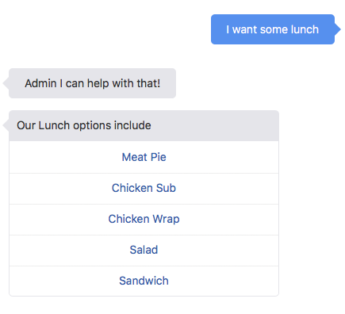

 - Select a “**Sandwich**”, the choice of which will allow the user to choose the contents via the “Sandwich Design Wizard” Instant App.which  will direct the user to the “Design Your Lunch” Wizard.
 
 
 
 - Click the link to launch the “Instant App” created earlier.

   NOTE: as you are running the Bot within a Web interface the Instant App will open in a new browser tab. 

 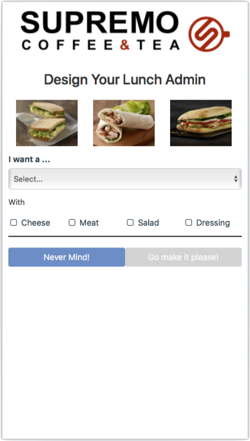
 
 - Choose **Sandwich** from the "**I want a...**" drop list.
 - Add some options to the Sandwich using the form UI elements. 
 
 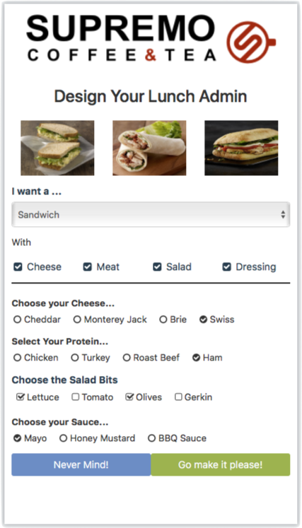
  
 - Once having selected the desired options click the **``[Go Make it please!]``** button.
 
 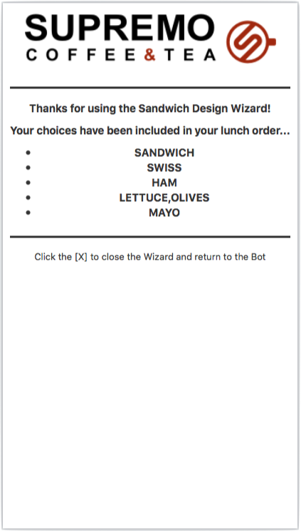
 
 - Having received the confirmation screen, click the [X] on the Browser Tab to Close the page.  Click back onto the Tab containing the Bot Tester.
 
   NOTE: that the values chosen in the Wizard have been passed back and are incorporated into the dialog flow.
   
 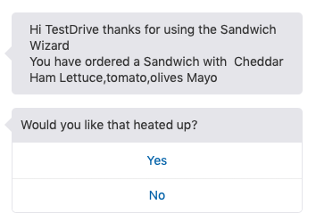
   
 - Choose whether you wish to have your sandwich “warmed” and complete the Lunch Order.

 - Say goodbye to the Café Supremo Bot.

 ## Conclusion ##
 
In this Lab you:
 - Saw how easily large amounts of static data can be integrated into a Dialogue Flow via the user of an “Instant App” form interface as part of the conversation. 
 - Extended an Instant App via the integrated Instant App builder
 - Integrated the Form into the Conversation allowing for two way data exchange – from bot to form, and back again.
 
 In [Lab 5](500-IB.md) & [Lab 6](600-IB.md) you have the option of exposing your Digital Assistant in:
 - [A Web Site](500-IB.md)
 - [A Social Channel - Facebook Messenger](600-IB.md)

## END OF HANDS-ON ##


# Lab Exercise: #
<< [Back to Digital Assistant Test Drive Home](../README-ODA.md)
