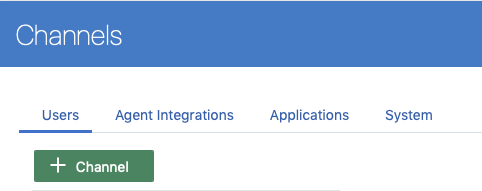
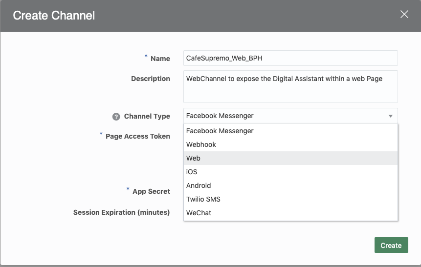

# ORACLE Cloud Test Drive #

## Lab 5 Exposing the Digital Assistant with a Web Page ##

### Introduction ###
Having built the Digital Assistant, the next step is to determine which "Channel" will be the most appropriate to use in order to maximise access by the user community.  For a B2C environment this may dictate the use of one of the popular Social Channels (such as Facebook Messenger or WeChat), while for an employee focused environment integration with the Corporate Intranet Portal may be the best option to allow easy access to the conversational interface.  

In this lab you will be see how easy it is to integrate a chat client into a web application, as shown below, via use of the JavaScript Client SDK.


### Pre-requisite ###
In order to host the web page you will deploy a simple Node.js based web server to your desktop.  This will require the instalation of the Node runtime for your operating system. While this lab should work successfully on older versions of Node, it is recommended that you upgrade to the latest stable (LTS) release for your platform.

- Goto [https://node.js.org](https://node.js.org) and download/install the current LTS release for your computer

  - **Note** The download for your OS should be the default option.

eg.


- Install the Node.js runtime and confirm that it is running successfully by executing the following command within a command Prompt/Terminal window.

`node --version`


# Lab Exercise #

## 1. Create a Web-Channel for your Digital Assistant

1. In the Digital Assistant Builder expand **``Development V``** section within the main menu and select the **``Channels``** submenu item


2. Click on the `[+ Channel]` button (under the **``users``** tab if not already selected)



3. In the Create Channel dialog, give the channel a Name and Description


<table width="50%" border="0">
  <tr>
    <td>Name:</td>
    <td>CafeSupremo_Web_[YOUR INITIALS]</td>
  </tr>
    <tr>
    <td>Description:</td>
    <td>Web Channel to expose the Digital Assistant within a Web Page</td>
  </tr>
  <tr>
    <td>Channel Type:</td>
    <td>Web</td>
  </tr>
</table>



Click `[Create]`

4. Select your newly created channel from the list of defined Channels and specify for which Bot it will be associated, by selecting your *Skill* from the *Pop-List* on the **``Route To:``** field.


5. Toggle the **``Channel Enabled``** switch to **ON** and copy the **App Id** value to a text editor for later use.


## 2. Configure the Web Application.

1. If you have not already done so, download the [Web App](Lab_Files/CTD3.0-CafeSupremo-Web.zip) to your Desktop.

2. Expand the Zip file (CTD3.0-CafeSupremo-Web).

3. Open a Command Prompt / Terminal Window and Navigate to the `CTD3.0-CafeSupremo-Web/app` folder.

4. Open the **index.html** file in a text editor (or HTML editor if you have one available) and scroll to the end of the document to find the indicated section.

```html
<!-- 
  =========================================================================== 
  =          Update the AppID entry in the loadBot() function               =
  =========================================================================== 
-->
  <script type="text/javascript" src="odaScript/chatWidget.js"></script>
      
  <script> 
        loadBot('REPLACE WITH THE DIGITAL ASSISTANT APPID');
  </script>
      
  <!-- ================================================================== -->
```
 - Replace the Parameter of the **loadBot()** Function with the **AppID** that you copied in the previous section.
 
 - Save the **index.html** file.
 
 5. Change directory back to the root folder for the web application (CTD3.0-CafeSupremo-Web).  Confirm that this folder contains a package.json file.
 
 6. Making sure you are in the directory specified, run the following command:
 
 **`npm install`**
 
- This will deploy the Web Server Application and any dependencies to the local Node.js Container that is installed on your computer


7. To run the Server execute the following command

**`node server.js`**

If the server starts correctly you should see a message reporting that the server is listening on **port 3000**


**Note:**  If you have another process currently running on Port 3000, you can change the listening port for the web server by editing the entry in the **server.js** file as follows;

```javascript
app.listen(3000, function() {
  console.log('listening on port 3000');
});
```
## 3. Accessing the your Digital Assistant

1. Open a browser and navigate to the the URL **[http://localhost:3000](http://localhost:3000)


2. Click the Digital Assistant Button to launch the Chat Client in the page. 


3. Enter one of the utterances you used in the second Lab.

eg. **`Can I have a beef pie`**


## 4. Customizing the "Look and Feel" of the chat client.
The colours and displayed text for the chat client can be easily modified by defining the appropriate settings within the Javascript Client SDK as follows;

1. In a Command Prompt/Terminal Navigate to the `CTD3.0-CafeSupremo-Web/app/odsScript` folder

2. Open the **chatWidget.js** file in a text editor and scroll down to the **loadBot()** function.

Review the various Settings in the **Bots.init()** function of the Web Channel SDK.

```javascript
Bots.init({
        appId: appId,
        businessIconUrl:   '/images/oracle-o-logo.png',
        businessName:      'Cafe Supremo CoffeeBot',
        businessIconUrl:   './css/images/CafeSupremo-Logo.png',
        buttonIconUrl:     './css/images/CafeSupremo-Bot-Button2.png',
        backgroundImageUrl:'./css/images/CafeBackground10.png', 
        buttonWidth:       '80px',
        buttonHeight:      '80px',
        customColors:      {
                            brandColor:       'ffcccc', 
                            conversationColor:'519FF7', 
                            actionColor:      '0057B8'
                           },
        customText:        {
                            headerText:       'The Best in Tea & Coffee',
                            inputPlaceholder: 'Send me a message...',
                            introductionText: 'Your Virtual Barista'        
                            // locale:                           'en-US',
                            // soundNotificationEnabled:          true,
                            // imageUploadEnabled:                true,
                            // displayStyle:                      'button',
                            // actionPostbackError:               'An error occurred while processing your action. Please try again.',
                            // clickToRetry:                      'Message not delivered. Click to retry.',
                            // conversationTimestampHeaderFormat: 'MMMM D YYYY, h:mm A',
                            // fetchHistory:                      'Load more',
                            // fetchingHistory:                   'Retrieving history...',
                            // invalidFileError:                  'Only images are supported. Choose a file with a supported extension (jpg, jpeg, png, gif, or bmp).',
                            // locationNotSupported:              'Your browser does not support location services or it’s been disabled. Please type your location instead.',
                            // locationSecurityRestriction:       'This website cannot access your location. Please type your location instead.',
                            // locationSendingFailed:             'Could not send location',
                            // locationServicesDenied:            'This website cannot access your location. Allow access in your settings or type your location instead.',
                            // messageError:                      'An error occurred while sending your message. Please try again.',
                            // messageIndicatorTitlePlural:       '({count}) New messages',
                            // messageIndicatorTitleSingular:     '({count}) New message',
                            // messageRelativeTimeDay:            '{value}d ago',
                            // messageRelativeTimeHour:           '{value}h ago',
                            // messageRelativeTimeJustNow:        'just now',
                            // messageRelativeTimeMinute:         '{value}m ago',
                            // messageTimestampFormat:            'hh:mm A',
                            // messageSending:                    'Sending...',
                            // messageDelivered:                  'Delivered',
                            // sendButtonText:                    'Send',
                            // settingsHeaderText:                'Settings',
                            // tapToRetry:                        'Message not delivered. Tap to retry.',
                            // unsupportedMessageType:            'Unsupported message type.',
                            // unsupportedActionType:             'Unsupported action type.'
                           }
```
3. Set the following properties to Customise the Chat Client.

<table width="50%" border="0">
  <tr>
    <td>backgroundImageUrl:</td>
    <td>./css/images/CafeBackgroundNEW.png</td>
  </tr>
  <tr>
    <td>conversationColor:</td>
    <td>00cc33</td>
  </tr>
  <tr>
    <td>headerText:</td>
    <td>Cloud Test Drive</td>
  </tr>
  <tr>
    <td>introductionText:</td>
    <td>The New Digital Assistant</td>
  </tr>
</table>

4. **Save and Exit** the file and Navigate back to the root folder for the application `CTD3.0-CafeSupremo-Web`.

5. Terminate the running Web Application, by issuing a **`Control-C`** in the window in which you started the application.


6. Re-run the `npm install` and `node server.js` commands to load the new version of the Web Application into the Node container and to start up the Web Server.

7. Re-Open the **`http://localhost:3000`** URL in your browser


**Note:** You can clear the contents of the chat session, by clicking on the **`[Clear the Chat]`** button located just above the Page footer.

## Conclusion ##
 
In this Lab you saw how by use of the Digital Assistant Web-Channel and the Javascript Chat Client Client SDK, it is possible to quickly and easily add a Digital Assistant to your web site.  
 

## END OF HANDS-ON ##


# Lab Exercise: #
<< [Back to Digital Assistant Test Drive Home](../README-ODA.md)
