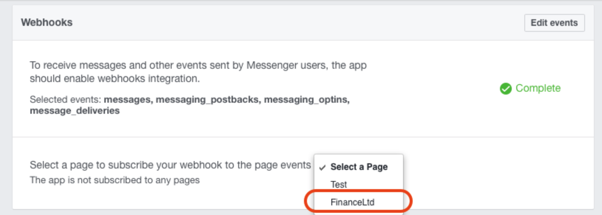

# ORACLE Cloud Test Drive #

## Lab 5: Exposing the Bot in Facebook ##

### Introduction ###

End users have a wide choice of messaging channels they may prefer to use, and in fact different demographics (age of the user, geography etc) have centralized on specific channels as their preferred messaging platform (such as Telegram being popular with a younger generation or WeChat being dominant with the Chinese user base).

 

There are different categories of channels as well, and broadly speaking, these can be categorized as follows: 
 - 3rd party Social Chat Channels (such as Facebook Messenger, WeChat, Line etc.)
 - Embedded Chat interfaces – extending current mobile and web apps to contain chat capabilities.
 - Virtual Assistants  -  (such as Siri, Cortana, Google Assistant, Amazon Echo, Google Home etc.)  In this category, the use of voice input has become the common approach to interaction.
 
The Oracle Intelligent Bot Platform supports the use of current (and future) conversational channels by abstracting away the channel client, providing out of the box integration to these channels (through the use of a standard Webhook standard interfaces).

In this Lab you will be integrating the Bot created in the previous Lab into Facebook Messenger.  This requires the following Steps.
 - Creating a Page in Facebook to receive the incoming messages from Facebook Messenger.
 - Creating A Facebook App to redirect the Messages to the Oracle Intelligent Bot Platform.
 - Wire the Facebook and Intelligent Bot platform together through the registration of each platform with the other, via the use of their Webhook addresses.

### Step1 ###

**NOTE:** Facebook has a habit of changing the layout of its pages in the Developer Portal.  As such, some of the screen shots in these notes may no longer be accurate.  If so please use the notes a concept guide and/or ask your instructor if you cannot find the function in the Developer Portal.

1. Login into your Facebook account and create a new page from the dropdown menu at the top right of your home page.

 

2. Select the type of Facebook page you want by selecting one of the options, for example "Company, Organization or Institution".

Choose the Company, Organisation or Intitution Tile and fill in the name (while not mandatory, use the same name as the Bot you created earlier)

3. You will need to configure your Facebook account as a "Facebook Developer Account".

Go to **https://developers.facebook.com** and in the resulting page select the Register button.

If you're already a registered Facebook developer, then you'll be logged in and are ready to create an app.

Once Registered you will want to add a new Facebook App

4. In the Create a New App ID dialog enter the name **``MyCafeSupremo_TD_{YOUR INITIALS>}``** and then select a Category (Retail). The app will represent your chatbot in Facebook. Also supply a contact email address then click the Create App ID button. The name of this Facebook App is not yet connected to the name of your ChatBot. You will connect your ChatBot and the Facebook App in later steps.

5. The resulting page is the Facebook App dashboard for configuring your application. By default this typically takes you to the product page to add various products to your application. A product represents a service that Facebook provides. To support our bot, we will need to enable the Messenger product and Webhook product for the page we just created.

6. Select the Dashboard menu option in the left options. This shows you the top level information about your application of which the App Secret key will be needed for Intelligent Bot. Select the Show button in the App Secret field...

then copy down the App Secret key and you will use this shortly. You will have to provide your Facebook password to
view the key. Copy this value into a text editor for later.

7. Click on the [Add Product] button on the left so we can add the Messenger product. From the resulting list select **Messenger** item in the list.

8. In the Messenger settings page create a Page Access Token to identify the Facebook page, (that you created earlier), to which messages are sent from your Intelligent Bot. 

Scroll down to the Token Generation section, in the Page drop down select your page. In doing this Facebook will now generate a
Page Access Token. Copy this value into a text editor for later use.

### Step 2 ###
**Setup the Chat-Bot to use the Facebook Channel**

1. Go back to the Bot Environment and select the Settings Tab (last icon)

2. Select the **“Channels”** Tab Along the top of the page.

3. Click **New Channel** and fill in the Dialog box that appears Copy in both the **Page Access Token** and **App Secret** key you saved from Facebook, into the respective fields. Finally, set the Channel Enabled toggle to on and click the **[Create]** button.

4. In the resulting Channel definition screen, copy down the **Verify Token** and **Webhook URL**. 

These will be needed on the Facebook side to hook your ChatBot to your app.

5. As you will want your Bot to be available externally, for this exercise we will be using the ngrok service to give us an externally accessible URL.  The value for external URL will be given to you by your instructor.

Eg. : **``https://db8e8627.ngrok.io/``**

Replace the Base URL in the Webhook URL that you copied down with the **ngrok** entry point.

Hence,

**``http://bots-connectors:8000/connectors/v1/tenants/botslc01ga/listeners/facebook/channels/EC16A26B-101F-4F76-9F2A-082479AA5AA0``**

becomes

**``https://db8e8627.ngrok.io/connectors/v1/tenants/botslc01ga/listeners/facebook/channels/EC16A26B-101F-4F76-9F2A-082479AA5AA0``**

6. Return to the Facebook App screen in your other browser tab. 

Select the Messenger option in the list of Products on the left hand side, followed by the **[Setup Webhooks]** button of the Webhooks section.

7. In the resulting New Page Subscription dialog 
- copy the **modified Webhook URL** you wrote down from the Intelligent Bot channel into the Callback URL field
- copy the **Verify Token** value from the Intelligent Bot channel into the Verify Token Field. 

In the Subscription Fields options, select the following:
- Messages
- Message_postbacks

Click **``[Verify and Save]``**

If the verification is not successful, check the URL isvalid (with the correct ngrok entry) as well as the correct Verification token. 

8. In the updated Messenger Settings page, under the **Select a Page** dropdown, select the name of the page you created earlier then select
the Subscribe button.

9. Test the Bot in Facebook by going back to your page and clicking the **Test Button** option from the dropdown shown hovering over the [Send Message] button that is at the top of the page.

**Note:**
The **[Send Message]** button may also be found in the Page Posts or on the right hand side in older Pages.

eg.

# End Lab of Exercise #
<< [Back to Digital Assistant Test Drive Home](../README-ODA.md)
