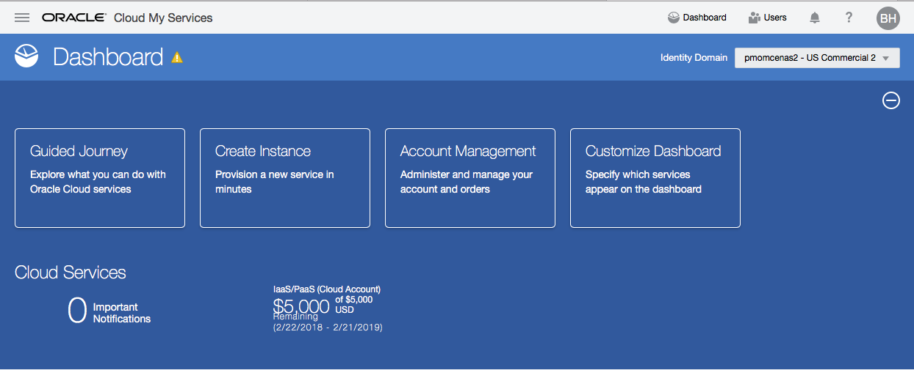
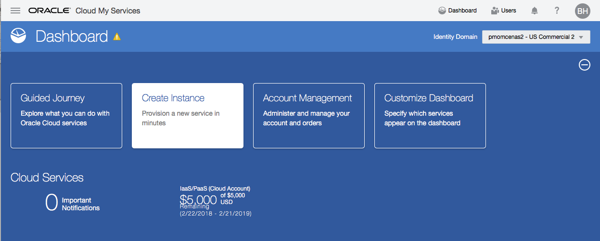
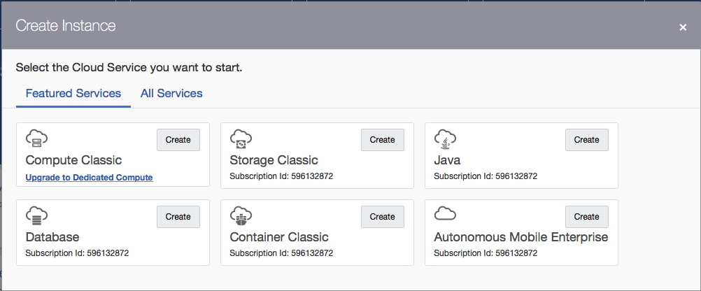
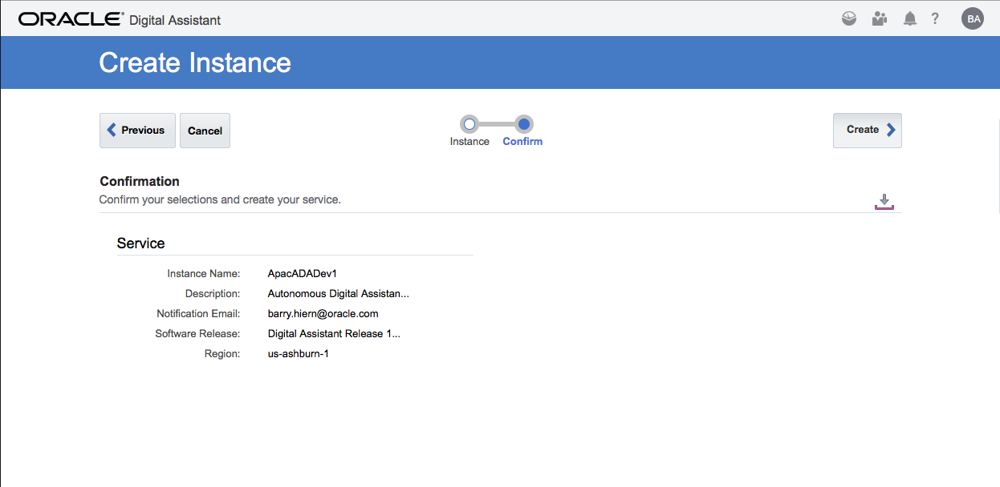
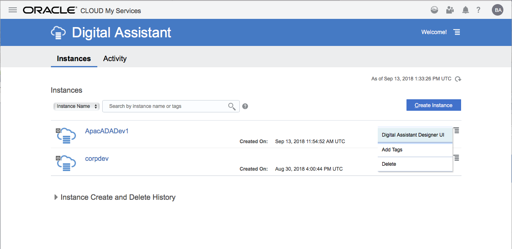
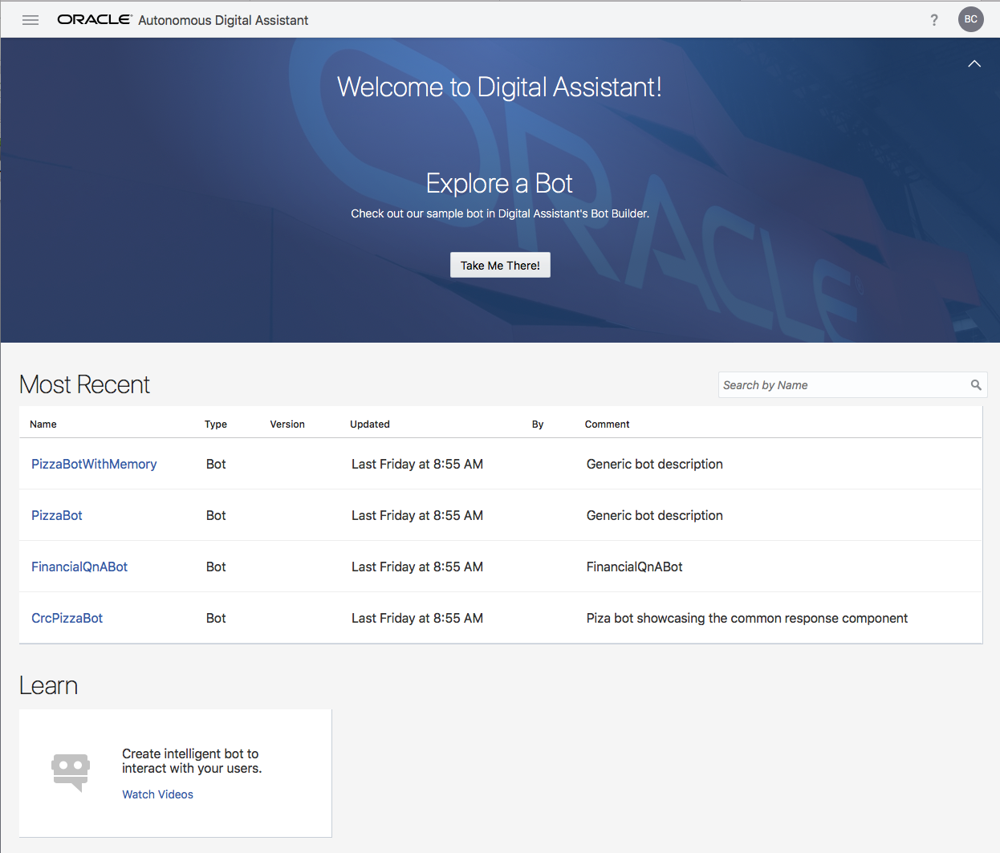

# Oracle Cloud Test Drive #

## Provisioning the Oracle Digital Assistant (ODA) ##

The Oracle Digital Assistant (aka ODA) is a stand-alone service for the development of AL/ML based Chatbots, that utilse sophisticated Natural Language Understanding (NLU) algorythms and non-linear dialogue flows to create a more natural, human-like conversational interface.

**Note** As a stand-alone service, the ODA does not include the Mobile Backend as a Service functionality; into which custom components that access backend data, may be executed.  As such, in order to execute the data driven custom components, please also provision the [Oracle Mobile Cloud](AM.md) Service prior to the Cloud Test Drive Workshop.

If you are looking to implement the CTD on a non-metered Service with a static requests/Hour metric (ie on AMCe) please use the steps for the [Autonomous Mobile Cloud Enterprice](AMCE.md)

Once your account is activated simply follow the steps below to provision the Digital Assistant.

### Provisioning Steps ###

1) Open your "My Services Dashbord" at the URL given to you as part of Account Creation

`https://myservices-<your account name>.console.oraclecloud.com/mycloud/cloudportal/dashboard`

2) Select the Create Instance Tile to bring up the Service Catalogue

3) Select the "**All Services**" tab and Scroll down the list of available services to the "**Application Development**" category

4) Click on the "**Digital Assistant**" tile to take you to the Autonomous Digital Assistant Dashboard.

5) Click on the **[Create]** button to define details of the new Digital Assistant.

6) Fill in the details for the new Digital Assistant instance

* Give the instance a meaningful name

**NOTE** Choose a name that is unique within the identity domain as it will be used identify this new instance.  The Service name cannot have more than 30 chars, must start with a letter and can contain only letters and numbers (no spaces or special characters).

* Enter a brief description to signify the purpose/intent of this instance (eg. Development, UAT, Production).

* Confirm the Email to which notifications concerning this new instance should be sent.

* Choose the appropriate Data Centre in which you wish to have the instance deployed (eg. us-ashburn-1)

Click **[Next >]**

7) Confirm the details for the Service and click the **[Create]** button

8) The creation process will take aproximately 1 hour.

Manually clicking the refresh icon will allow you to get an update on the current status

Expanding the "Instance Create And Delete History" accordian will show current and past provisioning activity for the Digital Assistant.

9) After approximately 1Hr the Registered Email account will receive an email notification  indicating that the specified Oracle Digital Assistant Service is now available.

10) Click on the "Activity Tab" within the Service Dashboard to confirm the successful creation of the service.

11) On the "Instances Tab" click the drop-down menu option against the named Digital Assistant

Select the **[Digital Assistant Designer UI]** option from the drop-down menu to open the **Oracle Digital Assistant** builder home page

12) Click the "Hamburger Menu" at the top left of the Home Page to expose the Main Menu to access the ChatClient SDKs, Documentation and the Chatbot development environment.  
 

The Oracle Digital Assistant is now fully provisioned.  If you have not yet provisioned the [Oracle Mobile Cloud](AM.md) please do so now.

<< [Back to Oracle Digital Assistant Test Drive Home](../README.md)
