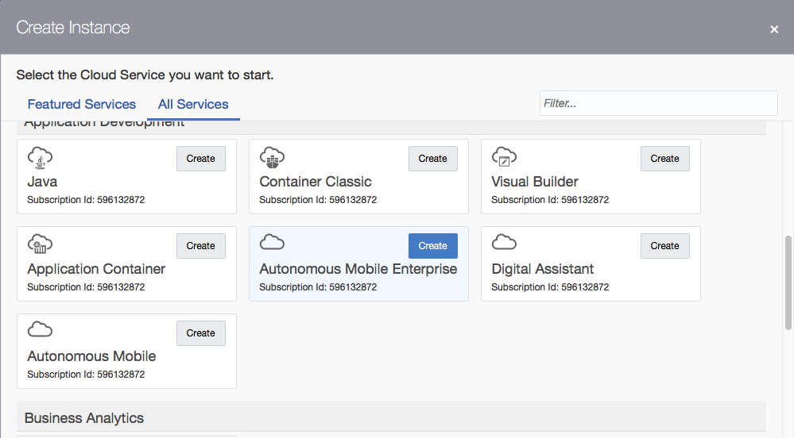
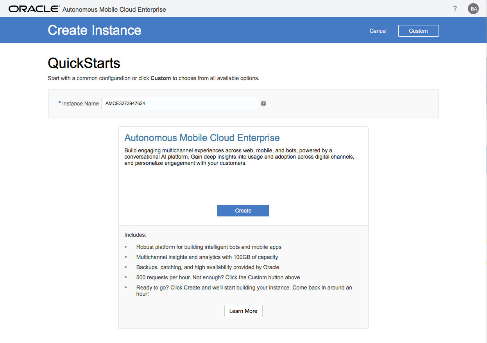
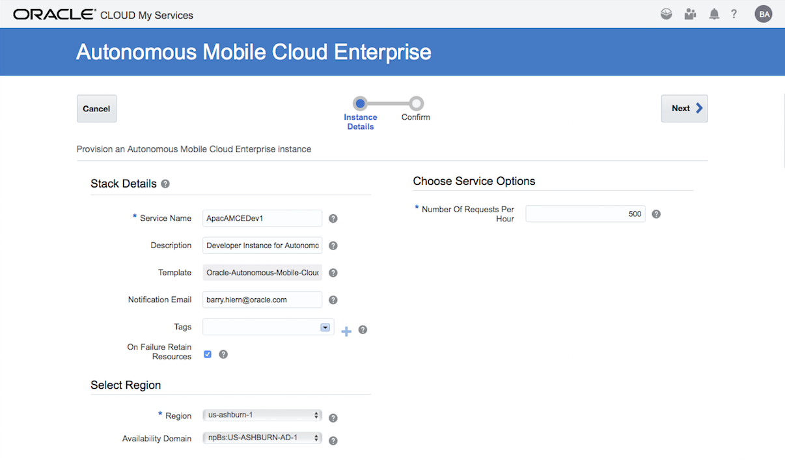
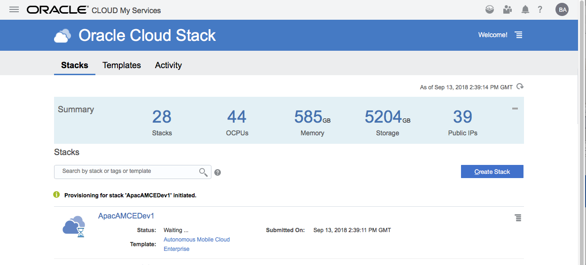
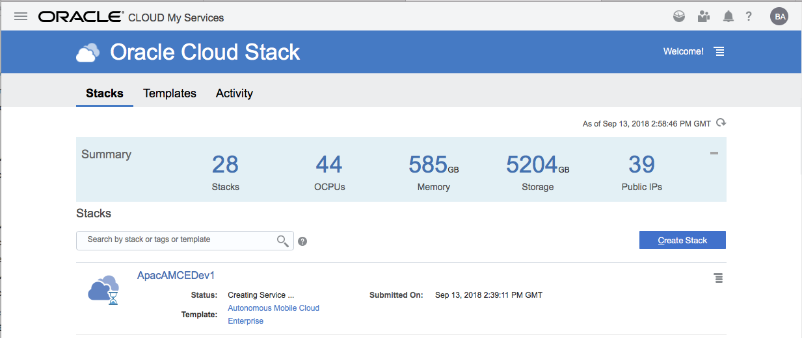
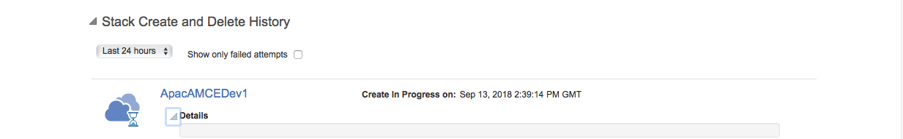
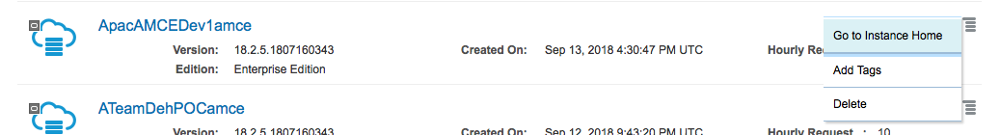

# Oracle Cloud Test Drive #

## Provisioning the Oracle Autonomous Mobile Cloud Enterprise (AMCE) ##

The Oracle Autonomous Mobile Cloud Enterprise(aka AMCE) is Oracle's Overall Mobile Platform Service for the development of both Chatbots and mobile applications.  It includes both the Intelligent Bot Service and the Mobile Backend As a Service.  The later supports the building sophiticated Mobile Applications that utilise Mobile Platform APIs to surface such functionality as Push Notifications, Location Services, Object Storage, User Management etc as well as the development of Mobile optimised Custom APIs to access data from the Systems of Record.  The Inteligent Bot Service allows for the declarative definitions of the Intents & Entities to be used for the NLU (natural Language Understanding) as well as the ability to define the Conferation Flow in Bot Markup Language (BotML). 

**Note** The Autonomous Mobile Cloud Enterprise is being superceeded by the combination [Oracle Digital Assistant](ADA.md) and [Autonomous Mobile Cloud](AM.md).  Unless you are looking to implement a non-metered Service implementation (with a static requests/Hour metric) or the ODA is not currently available in your datacentre of choice, it is recommended that you provision the [Oracle Digital Assistant](ADA.md) and [Autonomous Mobile Cloud](AM.md) in preference to AMCE.

Once your account is activated simply follow the steps below to provision the Autonomous Mobile Cloud Enterprise.

### Provisioning Steps ###

<< [Back to Digital Assistant Test Drive Home](../README-IBCS.md)