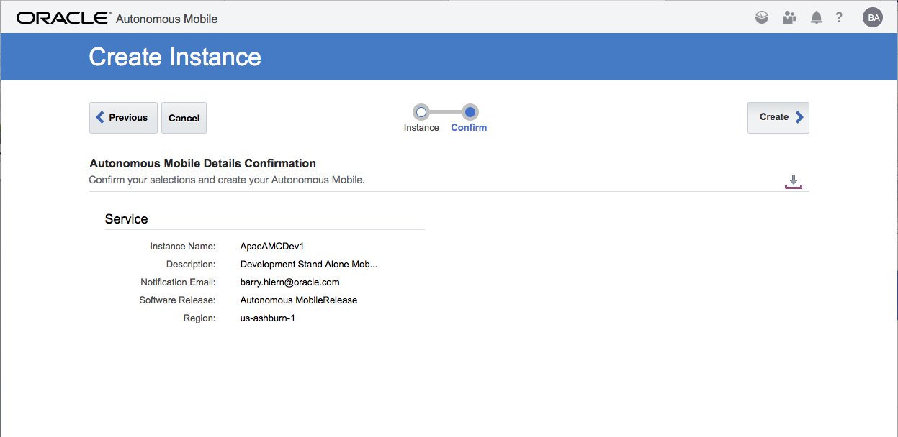
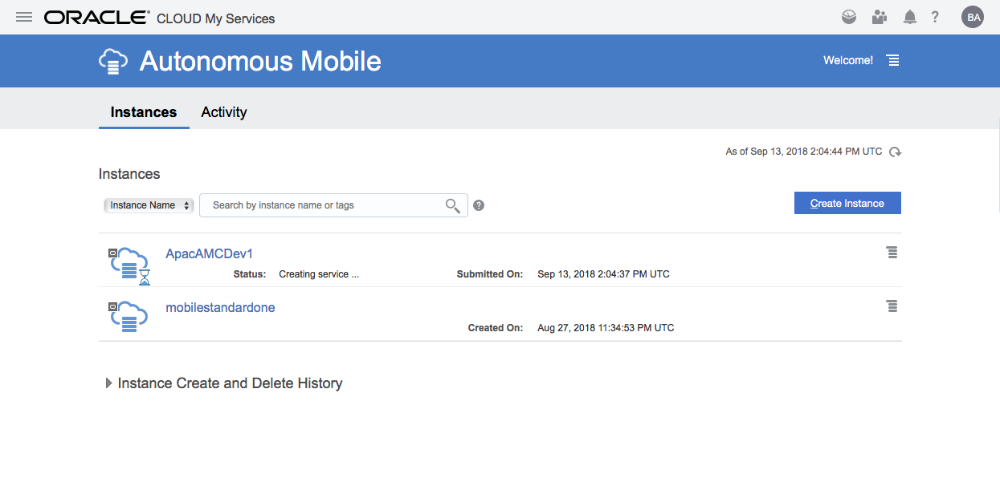
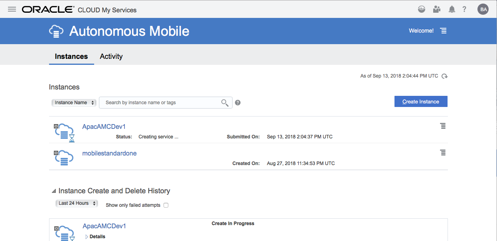
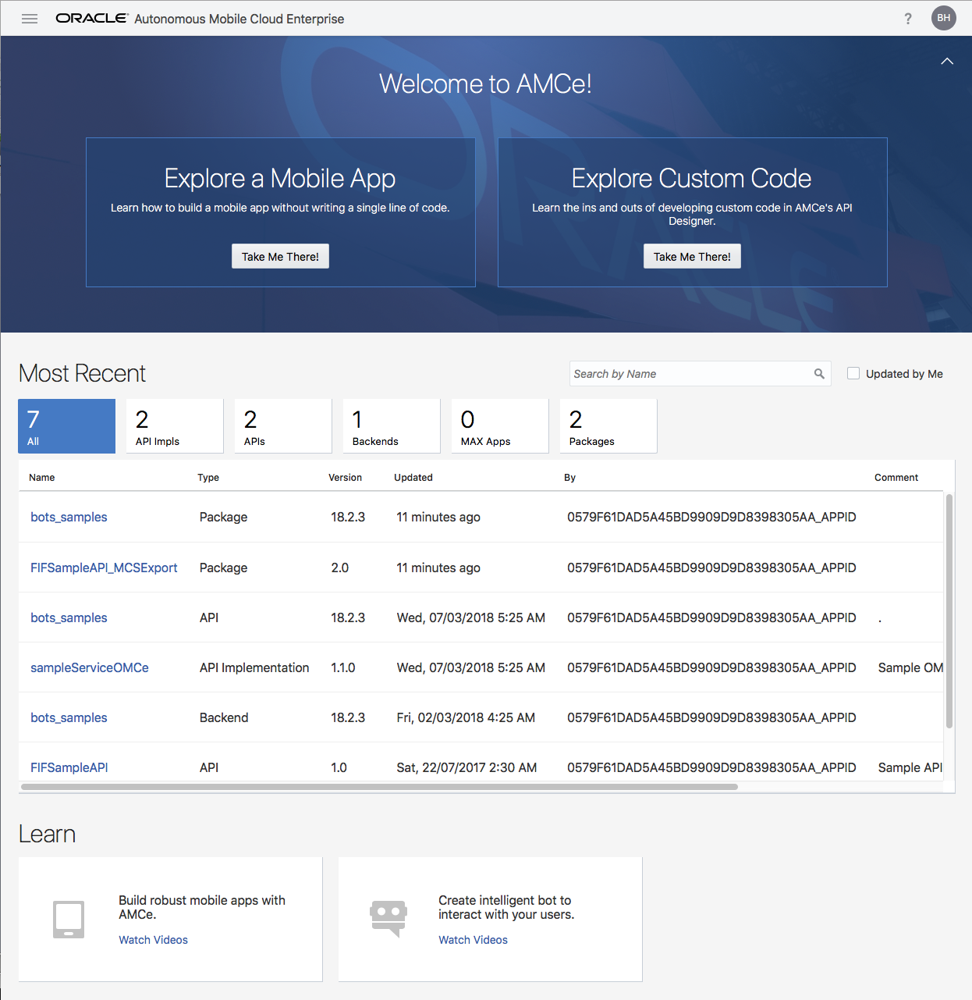
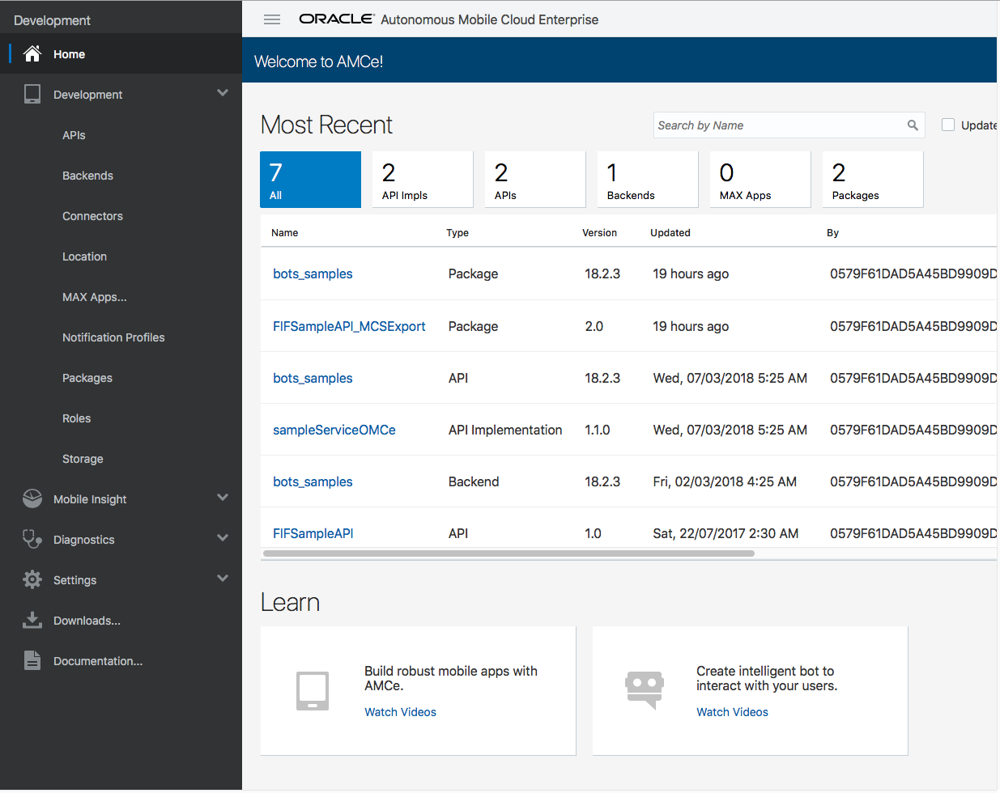

# Oracle Cloud Test Drive #

## Provisioning the Oracle Autonomous Mobile Cloud (AMC) ##

The Oracle Autonomous Mobile Cloud (aka AMC) is the stand-alone service for the MBaaS component of Oracle's Mobile Platform.  It supports the building sophiticated Mobile Applications that utilise Mobile Platform APIs to surface such functionality as Push Notifications, Location Services, Object Storage, User Management etc as well as the development of Mobile optimised Custom APIs to access data from the Systems of Record.  When used in conjunction with the Oracle Digital Assistant, it allows for the use of "Custom Component" within the Dialogue Flow; allowing the Digital Assistant (Bot) to respond to questions and intents with live data from your back end systems. 

**Note** As a stand-alone service the Autonomous Mobile Cloud does not include the Digital Assistant for the development of the Dialogues and Specification of the NLP (Intents and Entities).  As such please also provision the [Oracle Digital Assistant](ADA.md) Service.

If you are looking to implement a non-metered Service with a static requests/Hour metric please use the steps for the [Autonomoous Mobile Cloud Enterprice](AMCE.md)

Once your account is activated simply follow the steps below to provision the Autonomous Mobile Cloud.

### Provisioning Steps ###

1) Open your "My Services Dashbord" at the URL given to you as part of Account Creation

`https://myservices-<your account name>.console.oraclecloud.com/mycloud/cloudportal/dashboard`

2) Select the Create Instance Tile to bring up the Service Catalogue

3) Select the "**All Services**" tab and Scroll down the list of available services to the "**Application Development**" category

4) Click on the "**Autonomous Mobile**" tile to take you to the Autonomous Mobile Service Dashboard.

5) Click the **[Create Instance]** button to specify the details for the new Mobile Backend Service

* Give the instance a meaningful name

**NOTE** Choose a name that is unique within the identity domain as it will be used identify this new instance.  The Service name cannot have more than 30 chars, must start with a letter and can contain only letters and numbers (no spaces or special characters).

* Enter a brief description to signify the purpose/intent of this instance (eg. Development, UAT, Production).

* Confirm the Email to which notifications concerning this new instance should be sent.

* Choose the appropriate Data Centre in which you which to have the instance deployed (eg. us-ashburn-1)

6) Click **[Next >]** to move to the Confirmation Screen

7) Confirm that status is set to "creating service..."

Expanding the "Instance Create and Delete History" will show the current Status in more detail.

Manually clicking the refresh icon will allow you to get an update on the current status

8) Once the service is provisioned (about 1-2hours) an Email Notification will be forwarded to the registered Administration user.

Click on the Instance name Link to take you to the Service Dashboard

9) On the "Instances Tab" click the drop-down menu option against the named Mobile Service Instance

Select the **[Open Mobile Standard for SaaS Home Page]** option from the drop-down menu to open the **Oracle Mobile Cloud** build environment (this menu item text may change based on the SKU)

**Note** the product name in the page header may reflect the AMCE home page.  To confirm that this is in deed **Oracle Mobile Cloud** open the main menu by clicking on the Hamburger icon in the top left corner of the page.

The Menu shows the various components for building Mobile Applications alone and does not reference the "Bots" within the Menu structure.

The Oracle Mobile Cloud is now fully provisioned.  If you have not yet provisioned the [Oracle Digital Assistant](ADA.md) please do so now.

<< [Back to Digital Assistant Test Drive Home](../README-IBCS.md)