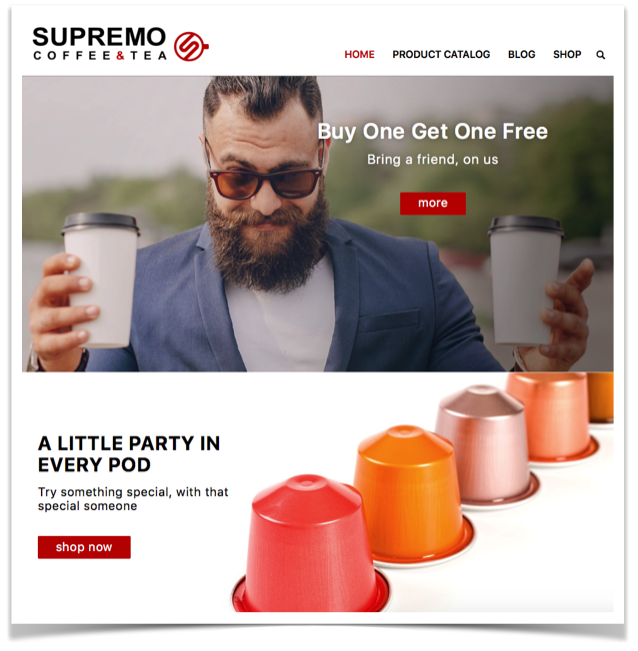
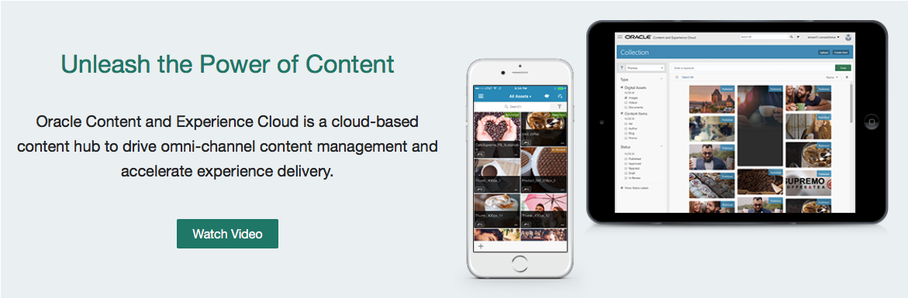

# ORACLE Cloud Test Drive #

## Content and Experience Cloud - Your Omni Channel Content HUB ##

### Introduction ###
This lab is part of the APAC Cloud Test Drive and these are the labs about Omni-Channel Content and Digital Experience.  

### About the Exercise Today ###

In this exercise, we will we will be building the Cafe Supremo Site using Content and Experience Cloud. We will guide you trough some of the key capabilities CEC has to offer in the form of exercises. Before each exercise you will learn about the tasks that you will be doing and about the functionality you're about to use.

**Oracle Content and Experience Cloud (CEC)** is a cloud-based content hub to drive omni-channel content management and accelerate experience delivery.

### Oracle Content and Experience Cloud enables: ###

**Enable Content Collaboration**

_Easily collaborate on content internally and with external teams. Discuss, share, and annotate content with mobile access, anywhere and anytime_

**Manage Content in One Central Hub**

_Leverage a single Content Hub to create, manage, and publish omni-channel content including digital assets, user-generated content, web content and business documents_

**Deliver Consistent Omni-Channel Experiences**

_Deliver engaging experiences across multiple channels with APIs for channel integration and business-friendly tools_

**Enhance Enterprise Applications with Content**

_Manage content from your enterprise applications, provide content services for existing content sources, and integrate data with content to enhance relevancy_

### Prerequisites ###
- Oracle Public Cloud Service account including Content and Experience Cloud

# Lab Exercise: #

#### Lab 1: Get started with Content and Experience [(Start Lab)](110/111-CecsLab.md) #### 
#### Lab 2: Working with Process Forms in Experience Cloud [(Start Lab)](200/210-CecsPCSLab.md) ####
#### Bonus Labs: Document Workflow in Content and Experience Cloud ####
  - ##### A: Content Metadata [(Start Lab)](200/203-CecsPCSLab.md) #####
  - ##### B: Document Workflow [(Start Lab)](200/201-CecsPCSLab.md) #####

